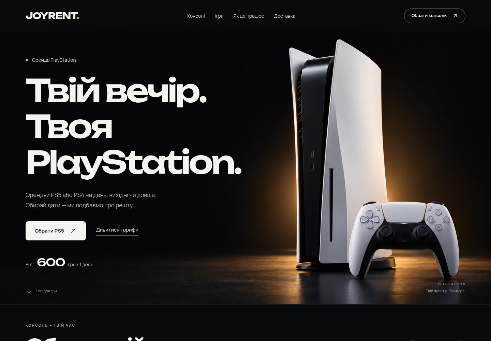

# JOYRENT

Украинский сайт аренды PlayStation 5 / PlayStation 4 на **WordPress + WooCommerce**. Реализован первый макет: почти чёрный фон, крупный Unbounded, Manrope для текста, студийные фотографии, спокойные анимации и мобильная версия.

[Тема WordPress — ZIP](releases/joyrent-1.0.0.zip) · [Плагин аренды — ZIP](releases/joyrent-rentals-1.0.0.zip) · [Визуальный просмотр — ZIP](releases/joyrent-preview-1.0.0.zip) · [Инструкция установки](docs/INSTALL.md)



## Что работает

- Семь тарифов из предоставленных скриншотов, переключатель PS5 / PS4 и калькулятор дат.
- Лента 12 популярных игр, категории, описание в диалоге, добавление пожеланий к заявке.
- Два шага оформления, проверка телефона и согласия, сохранение настоящей заявки в WooCommerce.
- Серверные цены, защита от повторных отправок и ограничение частоты заявок.
- Отдельные настройки доставки, залога, геймпадов и контактов в **WooCommerce → JOYRENT**.
- Редактирование игр, обложек и платформ в **Ігри JOYRENT**.
- Поддержка HPOS и обычного хранилища заказов. Локальные шрифты, WebP и reduced motion.

Заявка получает статус **«Заявка на оренду»**. Наличие, доставка, состав комплекта и залог подтверждаются магазином вручную. Сайт не списывает оплату и не резервирует количество консолей автоматически. Обычная покупка арендных товаров через корзину WooCommerce заблокирована, чтобы не обходить выбор дат.

| Консоль | 1 день | 3 дня | 7 дней | 30 дней |
|---|---:|---:|---:|---:|
| PS5 | 600 грн | 1 400 грн | 2 500 грн | 6 000 грн |
| PS4 | — | 750 грн | 1 200 грн | 2 500 грн |

Город, контакты и суммы залога/короткой доставки не выдуманы: до настройки форма показывает согласование. Доставка и подключение от семи дней бесплатны в зоне сервиса. Игровые иллюстрации сгенерированы для доборки; это не официальные обложки и не подтверждение наличия конкретного издания.

## Разработка

```bash
npm ci
npm run dev
npm test
npm run build
npm run preview
```

Dev-сервер использует локальный WordPress `http://localhost:8080` для REST. `npm run build` компилирует фронтенд и собирает три архива в `releases/`. `npm run preview` открывает статическую версию на `http://localhost:4173`; отправка заявок в ней отключена, поскольку требуется WordPress.

Исходники: `src/` и `components/ui/`; тема: `wordpress/joyrent/`; плагин: `wordpress/joyrent-rentals/`. React встроен в тему, Next.js не требуется. [Scroll Reveal Image](https://21st.dev/@unlumen/components/scroll-reveal-image) адаптирован из переданного пользователем промпта.

[Дизайн и архитектура](docs/superpowers/specs/2026-10-02-joyrent-design.md) · [План реализации](docs/superpowers/plans/2026-10-02-joyrent-build.md) · [Проверка дизайна](design-qa.md) · [Результаты проверок](docs/VERIFICATION.md)

Для публикации нужны домен/WordPress-хостинг и реальные условия магазина. Установочные архивы уже содержат сборку: Node.js на хостинге не нужен.
