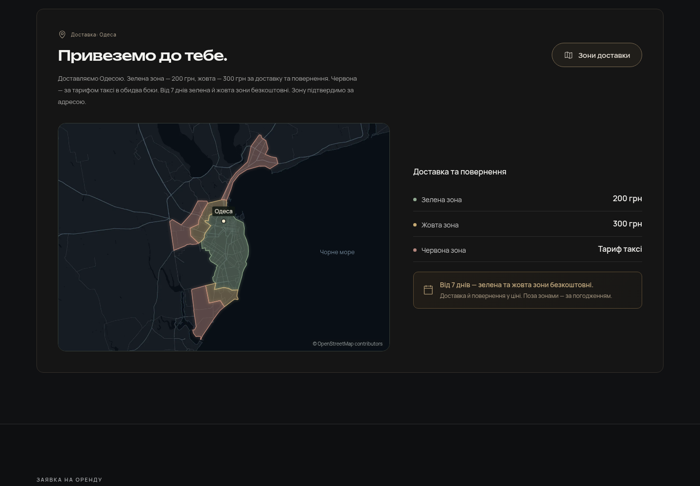

# JOYRENT

[Код, скриншоты и материалы — PR #1](https://github.com/jealouseq/Public/pull/1)

Украинская и русская версии сайта аренды PlayStation 5 / PlayStation 4 на **WordPress + WooCommerce**. Версия **1.8.1** устанавливает выбранную двухцветную иконку DualSense: белые рукоятки и золотая сенсорная панель. Широкая карта реальных дорог и побережья Одессы и компактные этапы аренды из 1.8 сохранены. Чёрный фон, мягкий янтарный свет, двухстрочный Unbounded и семь согласованных цен сохранены.

[Тема WordPress 1.8.1 — ZIP](releases/joyrent-1.8.1.zip) · [Плагин аренды 1.7 — ZIP](releases/joyrent-rentals-1.7.0.zip) · [Визуальный просмотр 1.8.1 — ZIP](releases/joyrent-preview-1.8.1.zip) · [Инструкция установки](docs/INSTALL.md) · [Материалы 1.8](docs/refinement-1.8/README.md)



Композиция 1.8: [этапы на телефоне](docs/refinement-1.8/screens/ua-mobile-process.png) · [доставка на телефоне](docs/refinement-1.8/screens/ua-mobile-delivery.png) · [этапы на ПК](docs/refinement-1.8/screens/ua-desktop-process.png).

## Иконка DualSense 1.8.1

Выбранный вариант 3 перенесён в общий SVG-компонент для этапов, выбора геймпадов и заглушки обложки. Невыбранный вариант приглушён, выбранный яркий; клавиатурный выбор и бесплатный второй геймпад сохраняются. [Сравнение и проверки](docs/refinement-1.8.1/README.md).

## История: что изменилось в 1.8

- Доставка показывает шесть точных зон на широкой тёмной карте реальных дорог и побережья Одессы. Рядом стоят цены и тёплый блок бесплатной доставки от семи дней для зелёной/жёлтой зоны. На компьютере кнопка карты находится в шапке; на телефоне широкое превью стоит над ценами, прежняя кнопка — по центру после них. [Источник OpenStreetMap и лицензия](docs/refinement-1.8/delivery-basemap-source.md).
- В каждом этапе иконка стоит рядом с заголовком: пара по центру, описание ниже по центру. На компьютере шаги соединяют короткие линии; на телефоне тонкая тёплая вертикальная линия остаётся в промежутках компактной последовательности.
- Ссылка «Як отримати консоль» / «Как получить консоль» в тарифах ведёт к этапам аренды. Общая иконка сайта повторяет подробный контур DualSense из финального изображения, выбранного пользователем. [Три сгенерированных варианта и итоговый SVG](docs/refinement-1.8/README.md#варианты-иконки) сохранены для сравнения.
- Тема и preview — **1.8.0**, плагин остаётся **1.7.0**. Для уже установленного плагина 1.7.0 достаточно заменить тему и очистить кэш. При более раннем плагине сначала установите существующий архив 1.7.0. Цены, игры, заявки и бизнес-настройки сохраняются.

[Материалы и проверки 1.8](docs/refinement-1.8/README.md). Опубликованный хостинг этим релизом не изменён. История предыдущих версий сохранена ниже.

## Предыдущий релиз: 1.7

- На телефоне основная кнопка hero стала компактнее. Телефон и Telegram в подвале стоят в одной строке с удобными областями нажатия; контакты открывают звонок и чат на главной и страницах FAQ, условий и конфиденциальности.
- Три этапа аренды соединены тонкой линией без рамок вокруг каждого шага. Доставка дополнена лёгким превью шести фактических полигонов Одессы; кнопка карты — 50px на ПК и 52px по центру на телефоне.
- У DualSense — плавный поворот и мягкий проход света, без изменения оригинальной фотографии. Эффекты останавливаются вне экрана и в скрытой вкладке; reduced motion показывает неподвижный оригинал. Подпись под фотографией убрана.
- Исправлены склонения и короткие состояния формы/игр UA/RU. Общее примечание к тарифам ограничивает бесплатную доставку зелёной и жёлтой зонами. FAQ и управляемые стандартные правовые тексты согласованы с бесплатным вторым геймпадом и фиксированным залогом; авторские условия сохраняются. Заголовки правовых страниц используют Onest и не выходят за ширину узкого телефона.
- Подготовлены [три SVG-варианта иконки](docs/refinement-1.7/README.md#варианты-иконки). На момент выпуска 1.7 вариант ещё не был выбран: общая иконка оставалась из 1.6. Фотографии и официальные обложки в 1.7 не заменялись.
- Изучены [шесть конкретных референсов 21st.dev](docs/refinement-1.7/reference-audit.md) для композиции и движения. Реализация самостоятельная; исходники без лицензии не копировались, новые зависимости не добавлены.

Для релиза 1.7 требовались **тема и плагин 1.7.0** вместе и очистка кэша WordPress/хостинга/CDN. [Экраны и проверки 1.7](docs/refinement-1.7/README.md) сохранены как история.

## Что изменилось в 1.6

- Стабильные кнопки перехода и отправки: «Назад → Далее» не отправляет заявку. Ошибка загрузки каталога видна заранее; повтор сохраняет выбор. Уникальные ID, доступность отдельных тарифов и общий лимит игр совпадают у интерфейса и REST.
- Игры можно выбрать в окне рядом с формой. На телефоне контактный шаг показывает редактируемое резюме, а нижняя панель — текущую консоль, срок и цену. Черновик выбора действует 30 минут в текущей сессии; контакты и согласие в него не записываются.
- BO7 и GT7 показывают локальных игроков для выбранной консоли. Обложки получают responsive-размеры, дальние карточки ждут прокрутки, а окно игры открывает полный оригинал.
- По Одессе доступны точные исходные зоны: зелёная — 200 грн, жёлтая — 300 грн за обе стороны; красная — тариф такси. От семи дней бесплатны зелёная и жёлтая зоны. До подтверждения адреса стоимость доставки остаётся ожидающей согласования.
- Один или два геймпада — без доплаты. Залог: PS4 — 7 500 грн, PS5 — 25 000 грн; он хранится отдельно и не добавляется к цене заявки. Телефон: [+380996669946](tel:+380996669946), Telegram: [@joyrent_od](https://t.me/joyrent_od).
- Уведомление магазина после сохранения защищено от повторов; ошибки можно повторить из заказа. Приватный получатель настраивается в админке и не попадает в публичный каталог. Проверка реальной доставки письма на хостинге остаётся установочным шагом.
- Новый исходник PS5 содержит реальные дополнительные детали, сохраняя композицию; размер — native 1448px, без увеличения до выдуманных 2K. Максимальный desktop DPR3 ещё требует исходник 2104px+. [Сравнения и ограничения](docs/refinement-1.6/README.md#изображения-и-загрузка).

Для обновления установите **тему и плагин 1.6.0** вместе. Эта сборка подготовлена и проверяется локально; опубликованный хостинг ею не изменён. История предыдущих версий сохранена ниже.

## Что изменилось в 1.5

- Контурные кнопки выбора тарифа с тонкими шевронами; прямые стрелки заменены. Доставка включена в карточки подходящих тарифов.
- Панель доставки с отдельными адресными инструкциями и условиями подключения; две колонки на ПК, последовательные части на телефоне.
- Плавное появление заголовка по словам; две строки и reduced motion сохранены. Новая общая иконка с узнаваемыми элементами DualSense.
- 20 игр с актуальными FC 27, UFC 6 и Black Ops 7; S.T.A.L.K.E.R. 2, Split Fiction, ASTRO BOT и другие новые позиции. Приоритет редактируется через «Атрибути → Порядок» в WordPress.
- Hover поднимает целую карточку без увеличения обложки. Диалог сохраняет её размер. Повторный CTA перед подвалом удалён.
- По указанию владельца тестового сайта старые FC 25, UFC 5 и Black Ops 6 удаляются при обновлении, без сохранения черновиков. Остальные авторские материалы, цены, настройки и заказы сохраняются.
- [Скриншоты, сравнения и анимация 1.5](docs/refinement-1.5/README.md) · [Проверенные версии игр](docs/refinement-1.5/catalog-research.md). Установите **тему и плагин 1.5.0**; опубликованный хостинг этим обновлением не изменён.

## Что изменилось в 1.4.2

- На телефоне заголовок занимает две строки в обеих языковых версиях; кнопки и цена расположены по центру.
- Переключатель консолей и содержимое тарифов центрированы. Третий тариф PS4 стоит по центру следующего ряда; выбор тарифа имеет удобную область нажатия.
- Даты получения и возврата стоят друг под другом на телефоне: поля не конкурируют за ширину. Отступы формы увеличены, даты используют шрифт16px.
- Одна тонкая иконка Iconoir PlayStation Gamepad с сенсорной панелью и двумя стиками во всех местах сайта. MIT-лицензия включена в тему; новых зависимостей нет.
- [Скриншоты, сравнения и проверка1.4.2](docs/refinement-1.4.2/README.md). Для обновления заменяется только тема, плагин остаётся1.3.

## Что изменилось в 1.4.1

- PS5 на ПК стала примерно на четверть крупнее и ближе к тексту. Подготовлен более крупный студийный план с тем же мягким янтарным светом и матовым полом.
- На телефоне сцена увеличена на12%; высота первого экрана, заголовок и кнопки сохранены.
- Нативное разрешение кадров покрывает Retina2× при новых размерах; preload обновлён вместе с responsive `sizes`.
- [Скриншоты, сравнения и проверка1.4.1](docs/refinement-1.4.1/README.md). Для обновления заменяется только тема.

## Основа главного экрана1.4

- Hero разделён на две колонки примерно 52/48. PS5 полностью помещается в самостоятельном изображении справа; фон плавно смешивается с чёрной страницей.
- Два новых кадра ImageGen: матовая студийная поверхность, контактные тени, один геймпад в физических пропорциях и мягкий янтарный свет. Отдельная мобильная композиция стоит под кнопками и ценой.
- Четыре WebP для разных размеров и плотностей экрана; WordPress заранее загружает только подходящий кадр. Размер изображения и место под текст зарезервированы.
- Заголовок Unbounded 550 и короткое проявление букв средствами CSS. Статичная консоль, reduced motion, без новых зависимостей. Из 21st.dev изучены принципы Blur Fade и Radial Glow.
- [Изменённые файлы, изображения, сравнения и проверки 1.4](docs/refinement-1.4/README.md). Для установленной 1.3 достаточно заменить тему; плагин остаётся1.3.

## Сохранённые изменения 1.2

- Плавное движение целого геймпада и мягкая подсветка; системное уменьшение движения останавливает эффекты.
- Три понятных этапа «Обери → Отримай → Грай»; условия доставки в отдельной компактной панели.
- Окно игры по центру; размер обложки сохраняется при открытии, без зума, растяжения и чёрных полос.
- FAQ вынесен на отдельные страницы `/faq/` и `/faq-ru/`; меню и подвал ведут в текущую языковую версию.
- Мобильное меню: удобные области нажатия, Escape, возврат фокуса, закрытие при смене ширины; нижний CTA не перекрывает первый экран.
- [Скриншоты, сравнения и анимации 1.2](docs/refinement-1.2/README.md). UA/RU и официальные обложки из 1.1 сохранены.

## Что работает

- Семь тарифов из предоставленных скриншотов, переключатель PS5 / PS4 и калькулятор дат.
- Лента 20 популярных игр, категории, описание в диалоге, добавление пожеланий к заявке.
- Два шага оформления, проверка телефона и согласия, сохранение настоящей заявки в WooCommerce.
- Серверные цены, защита от повторных отправок и ограничение частоты заявок.
- Отдельные настройки доставки, залога, геймпадов и контактов в **WooCommerce → JOYRENT**.
- Редактирование игр, обложек и платформ в **Ігри JOYRENT**.
- Поддержка HPOS и обычного хранилища заказов. Локальные шрифты, WebP и reduced motion.

Заявка получает статус **«Заявка на оренду»**. Наличие, доставка, состав комплекта и залог подтверждаются магазином вручную. Сайт не списывает оплату и не резервирует количество консолей автоматически. Обычная покупка арендных товаров через корзину WooCommerce заблокирована, чтобы не обходить выбор дат.

| Консоль | 1 день | 3 дня | 7 дней | 30 дней |
|---|---:|---:|---:|---:|
| PS5 | 600 грн | 1 400 грн | 2 500 грн | 6 000 грн |
| PS4 | — | 750 грн | 1 200 грн | 2 500 грн |

Согласованные условия 1.6: Одесса, телефон и Telegram выше, до двух бесплатных геймпадов и залог PS4/PS5 7 500/25 000 грн. Доставка от семи дней бесплатна только в зелёной и жёлтой зонах; адрес подтверждает магазин. Короткая доставка и красная зона рассчитываются по правилам карты. Карточки показывают официальные материалы конкретных игр. [Источники изображений](docs/game-artwork-sources.json); наличие и издание подтверждает магазин.

## Разработка

```bash
npm ci
npm run dev
npm test
npm run build
npm run preview
```

Dev-сервер использует локальный WordPress `http://localhost:8080` для REST. `npm run build` компилирует фронтенд и собирает три архива в `releases/`. `npm run preview` открывает статическую версию на `http://localhost:4173`; отправка заявок в ней отключена, поскольку требуется WordPress.

Исходники: `src/` и `components/ui/`; тема: `wordpress/joyrent/`; плагин: `wordpress/joyrent-rentals/`. React уже встроен в тему, Next.js не требуется. Ранее применённый Scroll Reveal заменён на плавную анимацию целого DualSense без изменения ширины. Анимация hero-заголовка в 1.5 использует CSS и принципы предоставленного пользователем Blurred Stagger Text.

[Дизайн и архитектура](docs/superpowers/specs/2026-10-02-joyrent-design.md) · [План реализации](docs/superpowers/plans/2026-10-02-joyrent-build.md) · [Проверка дизайна](design-qa.md) · [Результаты проверок 1.8](docs/refinement-1.8/README.md#проверка) · [История проверок](docs/VERIFICATION.md)

Для публикации нужны домен/WordPress-хостинг и реальные условия магазина. Установочные архивы уже содержат сборку: Node.js на хостинге не нужен.
