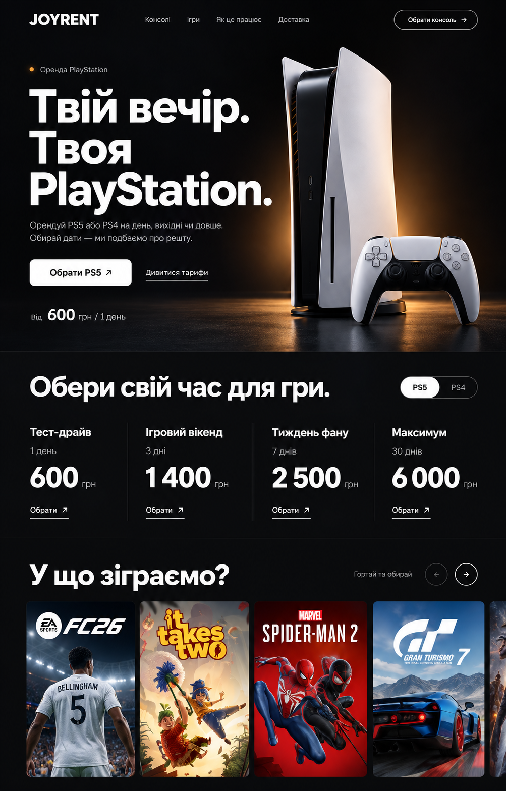
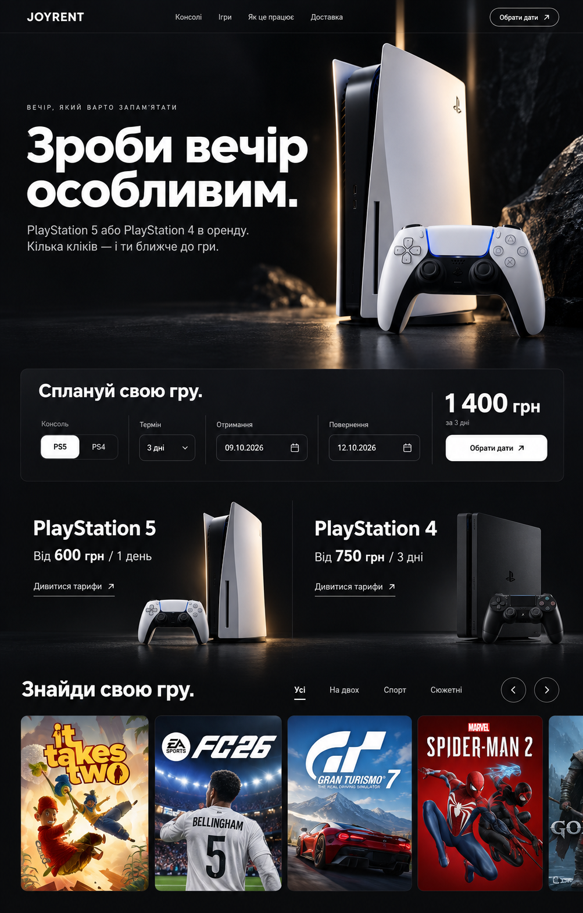

# JOYRENT

Украиноязычный магазин аренды PlayStation 5 и PlayStation 4.
Планируемая основа: WordPress + WooCommerce.

**Сейчас подготовлены структура, тарифная таблица, фотография PS5 и три визуальных концепции. Реализация ещё не начата: ожидается выбор макета.**

[Структура и архитектура проекта](docs/superpowers/specs/2026-10-02-joyrent-design.md)

## Визуальные концепции

Нумерация соответствует порядку показа трёх макетов главной страницы в чате. Это статические изображения; рабочая версия, адаптация и анимации создаются после выбора.

### Макет 1

### Макет 2

### Макет 3

## Фотография для первого экрана

## Анимации

Получен промпт [Scroll Reveal Image](https://21st.dev/@unlumen/components/scroll-reveal-image). Эффект будет адаптирован к теме WordPress и фотографиям PlayStation.

Обложки игр внутри макетов сгенерированы для иллюстрации композиции. Финальные материалы каталога должны соответствовать фактическим играм и изданиям JOYRENT.

## Следующий этап

Выбор макета, подтверждение условий аренды и подготовка плана реализации. Затем — тема WordPress, плагин аренды, каталог игр, мобильная версия, проверка заказа и устанавливаемые архивы.
