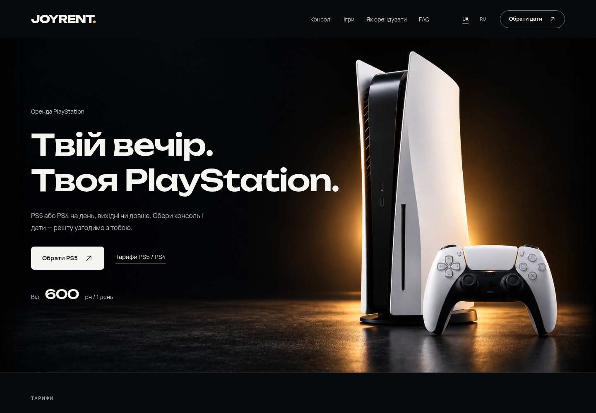

# JOYRENT

[Код, скриншоты и материалы — PR #1](https://github.com/jealouseq/Public/pull/1)

Украинская и русская версии сайта аренды PlayStation 5 / PlayStation 4 на **WordPress + WooCommerce**. Обновление 1.3: студийный фон PS5 с янтарным светом и фактурным полом, отдельный мобильный кадр, выразительный Unbounded и мягкое проявление букв из 21st.dev.

[Тема WordPress — ZIP](releases/joyrent-1.3.0.zip) · [Плагин аренды — ZIP](releases/joyrent-rentals-1.3.0.zip) · [Визуальный просмотр — ZIP](releases/joyrent-preview-1.3.0.zip) · [Инструкция установки](docs/INSTALL.md)



## Что изменилось в 1.3

- Сгенерированы два непрозрачных студийных кадра: широкий для ПК и квадратный для телефона. Фотографии показываются целиком, без зума и обрезки.
- Unbounded550 с более свободным межбуквенным расстоянием: две строки на ПК, перенос по словам на телефоне.
- [Blurred Stagger Text](https://21st.dev/@preetsuthar17/components/blurred-stagger-text) из предоставленного промпта: короткое проявление букв; reduced motion показывает текст сразу. Используется уже установленный Framer Motion.
- [Скриншоты, сравнения, результаты адаптации и видео 1.3](docs/refinement-1.3/README.md).

## Сохранённые изменения 1.2

- Плавное движение целого геймпада и мягкая подсветка; системное уменьшение движения останавливает эффекты.
- Три понятных этапа «Обери → Отримай → Грай»; условия доставки в отдельной компактной панели.
- Окно игры по центру; размер обложки сохраняется при открытии, без зума, растяжения и чёрных полос.
- FAQ вынесен на отдельные страницы `/faq/` и `/faq-ru/`; меню и подвал ведут в текущую языковую версию.
- Мобильное меню: удобные области нажатия, Escape, возврат фокуса, закрытие при смене ширины; нижний CTA не перекрывает первый экран.
- [Скриншоты, сравнения и анимации 1.2](docs/refinement-1.2/README.md). UA/RU и официальные обложки из 1.1 сохранены.

## Что работает

- Семь тарифов из предоставленных скриншотов, переключатель PS5 / PS4 и калькулятор дат.
- Лента 12 популярных игр, категории, описание в диалоге, добавление пожеланий к заявке.
- Два шага оформления, проверка телефона и согласия, сохранение настоящей заявки в WooCommerce.
- Серверные цены, защита от повторных отправок и ограничение частоты заявок.
- Отдельные настройки доставки, залога, геймпадов и контактов в **WooCommerce → JOYRENT**.
- Редактирование игр, обложек и платформ в **Ігри JOYRENT**.
- Поддержка HPOS и обычного хранилища заказов. Локальные шрифты, WebP и reduced motion.

Заявка получает статус **«Заявка на оренду»**. Наличие, доставка, состав комплекта и залог подтверждаются магазином вручную. Сайт не списывает оплату и не резервирует количество консолей автоматически. Обычная покупка арендных товаров через корзину WooCommerce заблокирована, чтобы не обходить выбор дат.

| Консоль | 1 день | 3 дня | 7 дней | 30 дней |
|---|---:|---:|---:|---:|
| PS5 | 600 грн | 1 400 грн | 2 500 грн | 6 000 грн |
| PS4 | — | 750 грн | 1 200 грн | 2 500 грн |

Город, контакты и суммы залога/короткой доставки не выдуманы: до настройки форма показывает согласование. Доставка и подключение от семи дней бесплатны в зоне сервиса. Карточки показывают официальные материалы конкретных игр. [Источники изображений](docs/game-artwork-sources.json); наличие и издание подтверждает магазин.

## Разработка

```bash
npm ci
npm run dev
npm test
npm run build
npm run preview
```

Dev-сервер использует локальный WordPress `http://localhost:8080` для REST. `npm run build` компилирует фронтенд и собирает три архива в `releases/`. `npm run preview` открывает статическую версию на `http://localhost:4173`; отправка заявок в ней отключена, поскольку требуется WordPress.

Исходники: `src/` и `components/ui/`; тема: `wordpress/joyrent/`; плагин: `wordpress/joyrent-rentals/`. React встроен в тему, Next.js не требуется. Ранее применённый Scroll Reveal заменён на плавную анимацию целого DualSense без изменения ширины. Для заголовка использован спокойный приём появления строк, как в [Reveal Text](https://21st.dev/@educalvolpz/components/reveal-text).

[Дизайн и архитектура](docs/superpowers/specs/2026-10-02-joyrent-design.md) · [План реализации](docs/superpowers/plans/2026-10-02-joyrent-build.md) · [Проверка дизайна](design-qa.md) · [Результаты проверок](docs/VERIFICATION.md)

Для публикации нужны домен/WordPress-хостинг и реальные условия магазина. Установочные архивы уже содержат сборку: Node.js на хостинге не нужен.
