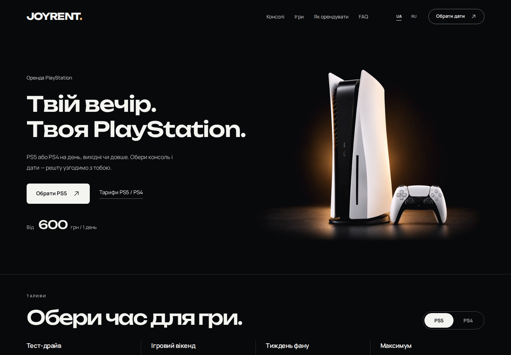

# Аудит JOYRENT 1.5

Проверен живой стенд [flowers-luxury.shop](https://flowers-luxury.shop/) и сборка `ed3145f` от 3 октября 2026 года. Визуальную основу стоит сохранить: чёрная студия, тёплая подсветка, полные силуэты PS5 и DualSense, крупные цены и Unbounded. Главная недоработка — связь выбора с заявкой. Исправление ошибок формы и каталога принесёт больше пользы, чем новые декоративные блоки.

Это результаты аудита и план следующей сборки. Продуктовые файлы и архивы 1.5 не изменены. На стенд не отправлялись заявки: все попытки POST в браузерной проверке перехвачены до передачи серверу. Серверные сценарии проверены на отдельном локальном WordPress.

## Что проверено

- Свежие страницы живого сайта UA/RU: ПК 1440×1000 и телефон 390×844 CSSpx, Chromium, DPR1. Главный экран, PS5/PS4, тарифы, фильтры, карточка игры, выбор даты и геймпадов, контакты, валидация, условия, конфиденциальность, FAQ и возврат. Это эмуляция телефона; физический iPhone/Safari не проверен.
- Локальная сборка UA/RU на 320, 390, 768, 1440 и 1920px; ошибки и задержки каталога, 13 игр, повторный переход между шагами, сохранение состояния. Нормальные загрузки не дали горизонтального переполнения или необработанных ошибок JavaScript.
- Реальный локальный REST/WooCommerce: серверные цены, валидация, повтор запроса, конкурентные запросы, миграции, уведомления. Наличие и стоимость на хостинге сверены только публичными GET.
- История баннера, оригиналы и WebP, 21 сочетание ширины/DPR, SHA-256 четырёх файлов на хостинге. Развёрнутые JS/CSS соответствуют сборке 1.5; это не аудит старой закэшированной вкладки.
- 21st.dev: основные разделы, индекс библиотек, шаблоны и темы, 30 категорий. Собрано 1458 уникальных ссылок компонентов/вариантов; визуально изучены 9 превью компонентов и 3 превью шаблонов. Это широкий обзор каталога, а не индивидуальная проверка каждого компонента и его кода.
- Официальные страницы EA, PlayStation и Activision: свежие версии, платформы, локальные игроки и происхождение новых обложек. Статистика популярности по Украине не заявляется.

## Живой сайт

[Главная UA на телефоне](screens/ua-mobile-hero.png) · [Главная RU на телефоне](screens/ru-mobile-hero.png) · [Тарифы PS4 на телефоне](screens/ua-mobile-rates-ps4.png) · [Окно игры на телефоне](screens/ua-mobile-game-detail.png) · [Форма на ПК](screens/ua-desktop-booking-7days.png) · [Форма на телефоне UA](screens/ua-mobile-booking-7days.png) · [Форма RU](screens/ru-mobile-booking-7days.png) · [Меню RU](screens/ru-mobile-menu-open.png) · [FAQ](screens/ua-mobile-faq.png)

Полный браузерный проход сохранил 103 актуальных снимка; в отчёт включены выбранные состояния. [Сводка живой проверки](evidence/live-browser-summary.json) и [манифест всех захватов](evidence/live-browser-screenshots-manifest.json) фиксируют охват. Снимки сделаны после загрузки изображений. Даты в этих Chromium-снимках оформлены браузером окружения; они не доказывают формат системного календаря iOS. Анимационные промежуточные кадры и неверно названные ранние пробы не используются как основание выводов.

## Путь пользователя

| Шаг | Состояние | Вывод и необходимая доработка |
|---|---|---|
| 1. Главная и меню | Визуально хорошо | Заголовок читается в две строки на ПК и телефоне, действия и цена на телефоне центрированы. Иерархию и сцену сохранить. Повышать качество исходника, а не снова увеличивать PS5 до обрезки. |
| 2. Консоль и тариф | Хорошо с расхождением | Семь цен совпадают с заданными. Контурные кнопки и шевроны подходят стилю; PS4-третий тариф центрирован. Выбор передаётся в форму. Включённая доставка должна совпадать с итогом заявки. |
| 3. Игры | Нужны исправления | Обложки и спокойный hover подходят. Дубли ломают фильтры; число локальных игроков у двух игр зависит от консоли. Выбор игры из формы уводит вверх без явного возвращения к текущей заявке. |
| 4. Комплект и получение | Визуально хорошо, условий недостаточно | DualSense и мягкое движение оставить. Панель доставки читается лучше прежней полосы. До запуска нужны настоящий город/зона сервиса и контакт; сейчас они не заполнены. |
| 5. Даты, геймпады, сумма | Нужна связь состояний | Даты на телефоне больше не слипаются. Цена выбранного тарифа меняется правильно. Мобильная панель показывает стартовую цену даже после выбора недели; доставка в итогах противоречит тарифу. |
| 6. Контакты и отправка | Критическая ошибка | «Назад → Продовжити» отправляет валидную заполненную заявку без нажатия «Надіслати». На первом переходе также преждевременно запускается браузерная проверка ещё пустых контактов. |
| 7. FAQ, условия и подтверждение | Частично хорошо | Отдельный FAQ разгружает главную. Диалоги имеют правильную нативную семантику и закрываются с возвратом фокуса. Переход на отдельную страницу сбрасывает заявку; UA-ссылка полной политики отсутствует. Уведомление магазина надо подключить и проверить перед запуском. |

## Приоритетные исправления

P1 — исправить перед приёмом настоящих заявок. P2 — исправить в ближайшей сборке. P3 — визуальная, техническая или установочная доработка. «Локальная проверка» означает воспроизведение в сборке с тем же кодом; это не утверждение об отправленной заявке или внешних интеграциях хостинга.

| ID | Приоритет и доказательство | Проблема | Конкретное исправление |
|---|---|---|---|
| F01 | **P1**, живой браузер UA/RU ПК/телефон и локальная проверка | Заполнить контакты и согласие, нажать «Назад», затем «Продовжити»: создаётся POST без нажатия отправки. Условные кнопки используют один DOM-узел; его `type` меняется во время клика. | Разделить стабильные кнопки перехода и отправки, предотвратить действие отправки при переходе. Проверять намерение отправить в обработчике. Добавить регрессию «Назад → Далее» с заполненной формой. |
| F02 | **P1 перед запуском**, код и локальный WooCommerce | Встроенное уведомление о `jr-request` отсутствует. Локальная заявка сохранена, попыток email — 0; стандартный Woo New Order не срабатывает на этот переход. | Подключить одно надёжное уведомление магазина после создания заявки, с защитой от повторной отправки. Проверить получателя и доставку. Внешние SMTP/плагины хостинга и его почтовый ящик не проверены. |
| F03 | **P2**, живой GET, DOM и контрольная локальная проверка | REST отдаёт **25 записей / 20 уникальных ID**. PS5 показывает 24 записи / 19 уникальных игр, поскольку MK11 относится только к PS4. После «Усі → На двох» остаётся **13 карточек вместо 8**: пять одиночных игр удерживаются в DOM. Повторные фильтры увеличивают число лишних карточек. | Уникальные ID на сервере и во фронтенде, согласованное удаление лишних управляемых записей, блокировка параллельной миграции. Фильтры исходных записей правильные; менять категории одиночных игр для маскировки ошибки не нужно. Историческая причина дублей на хостинге не доказана. |
| F04 | **P2**, локальная проверка отказа GET | Сбой загрузки каталога скрыт. Пользователь заполняет контакты, затем получает сообщение о недоступности магазина без повторной загрузки. | Состояния загрузки/ошибки/готовности и короткое действие «Повторити / Повторить» в существующей форме. Не допускать переход к отправке до актуального каталога; сохранять выбор при повторе. |
| F05 | **P2**, локальная проверка задержки GET | Можно выбрать игру из временного каталога; после прихода пустого каталога остаётся безымянный выбранный элемент. Сервер такую игру отклоняет. | Выбор только из загруженного каталога; сверять выбранные ID и платформы при каждом его обновлении. |
| F06 | **P2**, локальная проверка; живые ссылки соответствуют | FAQ и полные условия открываются в той же вкладке. Возвращение к форме теряет консоль, срок, дату, игры и контакты. | Сохранять короткоживущий черновик между внутренними информационными переходами и сверять его с актуальным каталогом. Не превращать черновик в долговременное хранение персональных данных. |
| F07 | **P2**, локальный реальный REST | Интерфейс разрешает 13+ игр; сервер ограничивает 12 и отклоняет заявку с общим сообщением. | Одна политика для UI и сервера. Для списка пожеланий лучше разрешить все уникальные игры текущего каталога с разумной серверной границей; если лимит нужен, объяснять его при попытке добавить лишнюю игру. Постоянный счётчик не требуется. |
| F08 | **P2**, живой boot и диалог | UA-политика не имеет «Повна інформація»: `privacyUrl` пустой. RU-ссылка есть. Опция WP может ссылаться на стандартную черновую политику, хотя страница JOYRENT опубликована. | Правильно выбрать опубликованную политику; безопасный запасной URL UA-страницы. Сохранить корректную авторскую политику, если владелец её назначил. |
| F09 | **P2**, локальная проверка конфигурации | Снятие одного тарифа с публикации отключает приём заявок всей витрины, продолжая показывать недоступный тариф. | Доступность каждого тарифа отдельно; скрывать отсутствующие варианты и сохранять работоспособность доступных. Это не обнаруженное отключение текущего стенда. |
| F10 | **P3**, замеры и снимки | Граница поля относительно заливки — 1,61:1; вторичные мобильные цели — 28–35px высотой. Важные пояснения имеют размер 10–12px. | Чуть усилить контур полей, увеличить невидимую область нажатия до удобных 44px и важные пояснения до 13–14px. Это рекомендация удобства; 44px не объявляется обязательным минимумом WCAG AA для каждой кнопки. |
| F11 | **P3**, новая локальная установка с WP en-US | UA-страницы условий/политики наследуют язык WordPress, вместо явного `uk`. | Задать язык по фиксированному маршруту страницы. **На живой UA-странице сейчас `lang=uk` корректный**; это переносимость установки. |
| F12 | **P2**, живой браузер и код фронтенда/сервера | От 7 дней тариф пишет «Доставка включена», итог — «За адресою / По адресу». При `deliveryFee=null` проверка неизвестной цены выполняется раньше порога бесплатной доставки; сервер тоже сохраняет её как ожидающую согласования. | Сначала применять условие бесплатной доставки в зоне сервиса, затем неизвестную цену короткой аренды. В итогах писать «Включено». Зону всё равно подтверждает магазин. |
| F13 | **P2**, живой телефон | После выбора PS5 на 7 дней итог — 2500 грн, а панель у игр остаётся «від 600 грн / 1 день». Формально это стартовая цена, но она не связана с текущим выбором. | Показывать выбранную консоль, срок и цену в мобильной панели; до выбора можно оставить цену «від». Переход должен возвращать к сохранённой заявке. |
| F14 | **P2**, официальные сведения | BO7: PS5 до 2 локальных игроков, PS4 без split-screen. GT7: PS5 до 4, PS4 до 2. Одна общая цифра на обе консоли скрывает возможности совместной игры. | Количество локальных игроков и фильтры — по выбранной платформе. В BO7 кратко указать необходимость интернета; сетевой доступ не обещать без подтверждения магазина. |
| F15 | **До публичного запуска**, живой каталог | Город, телефон, email и Telegram не заполнены. «У зоні сервісу» не объясняет, обслуживается ли город пользователя. | Настроить реальные регион и хотя бы один контактный канал; согласованные короткая доставка, залог и второй геймпад должны быть отражены в настройках. Не придумывать условия. |
| F16 | **P3 по качеству изображения**, файлы и DPR-замеры | Пропорции правильные, но большой экран с плотностью 3× требует больше пикселей, чем есть в текущем desktop-файле. | Сохранить композицию. Для мобильного использовать 1448px производный файл из существующего мастера; для большого DPR3 — настоящий более детальный исходник около 2200px шириной. Увеличение размеров файла само по себе деталей не добавит. |

Полные воспроизведения и ссылки на исходники: [технические находки](evidence/findings.json), [перехват Continue](evidence/continue-submit.json), [дубли и фильтры](evidence/duplicate-filters.json), [контроль с уникальными ID](evidence/duplicate-control.json), [доставка и нативный диалог](evidence/delivery-dialog.json), [уведомления](evidence/notifications.json). Контакты в тестовых запросах — искусственные данные аудитора.

## Качество баннера PS5

**Это новый более крупный кадр из 1.4.1, а не непропорционально растянутый старый баннер. В 1.5 используется тот же файл.** История Git фиксирует новый студийный master и изменение кадра; исходные логи генератора в репозитории не сохранены. CSS дополнительно показывает изображение пропорционально крупнее. Во всех 21 замерах отношение сторон осталось 4:3, на самом `img` нет blur-фильтра или растягивающего transform.

| Сценарий | Изображение на экране | Реальный файл | Вывод |
|---|---:|---:|---|
| ПК 1440px, DPR2 | 658px по ширине | 1448×1086 | Пикселей хватает. |
| ПК 1440px, DPR3 | 658px, требуется около 1975 пикселей | 1448×1086 | Браузер увеличивает исходник примерно на 36% по ширине. |
| Большой ПК, DPR3 | 701px, требуется около 2104 пикселей | 1448×1086 | Увеличение примерно на 45%; мелкие детали смягчаются. |
| Телефон 390px, DPR3 | 383px, требуется около 1149 пикселей | 1120×840 | Недостача небольшая, около 2,6% увеличения. |
| Максимальная мобильная композиция, DPR3 | 493px, требуется около 1478 пикселей | 1120×840 | Поможет производный файл 1448px из имеющегося мастера. |

На обычных DPR1/2 экранах достаточное разрешение. Часть мягкости уже есть в сгенерированном оригинале: мелкие кнопки, фактура пластика и пола. WebP немного сглаживает детали дополнительно. Сильной блочной пикселизации и искажения пропорций в проверенных кадрах нет. Файлы на хостинге **байт в байт совпадают** с четырьмя WebP сборки; дополнительного ухудшения со стороны публикации не обнаружено.

[Подробная проверка изображения](image-quality.md) · [Замеры](evidence/measurements.csv) · [Хеши хостинга](evidence/deployed-asset-hashes.json)

## Структура следующей версии

Для чтения главная уже имеет понятный порядок: **главный экран → тарифы → игры → комплект → получение и доставка → заявка → подвал**. Переставлять все секции ради новизны не требуется. FAQ оставить отдельной страницей, повторный финальный CTA не возвращать.

Путь оформления должен быть связанным: **консоль и срок → дата → геймпады и необязательные игры → контакты → явная отправка → номер заявки**. Выбранное сохраняется при переключении языка, открытии правил и возвращении из FAQ. Итог и мобильная панель показывают один и тот же выбор.

В существующей форме «Обрати ігри» лучше открывать подборку рядом с текущей заявкой, сохраняя позицию и выбор, вместо прокрутки далеко вверх. На контактном шаге телефона оставить поля контактов и компактное резюме с действием редактирования; весь большой блок выбора консоли и дат над ними повторять не нужно. При добавлении игры должно быть очевидно, что она добавлена и как продолжить текущую заявку. Эту связь следует сделать действием, а не новыми счётчиками или рекламным текстом.

## Визуальная доработка

| Область | Предлагаемое решение |
|---|---|
| Заголовки | Сохранить Unbounded, две строки и нынешний характер. Манера уже узнаваемая. Не менять весь сайт на ещё один декоративный шрифт. |
| Основной текст | Manrope оставить; важные условия и подписи сделать 13–14px на телефоне. Названия игр и подсказки формы нуждаются в читаемости больше, чем в новом шрифте. |
| Анимация текста | Одно быстрое мягкое появление заголовка. На финальных ценах и полях не повторять blur; reduced motion показывает всё сразу. |
| Подсветка PS5 | Сейчас тёплый свет встроен в фото и статичен. Если оживлять его, достаточно одного очень слабого светового цикла 8–12 секунд; изображение не перемещать и не увеличивать. При reduced motion свет статичен. |
| DualSense | Сохранить фото, медленный малый ход и слабый свет. Уточнять амплитуду только при повторном визуальном сравнении; фотография уже понравилась владельцу. |
| Игры | Сохранить подъём карточки на hover и отсутствие зума картинки. Открытый диалог на ПК и телефоне уже центрирован, без чёрной рамки и обрезки. |
| Иконки | Текущий общий контур держит единый стиль. Системные пиктограммы оставить одной семьи и толщины. Достоверная форма контроллера важнее ещё одной декоративной иконки. |
| Отступы | Изменять внутри формы и контактного шага; основные секции уже разделены. Не добавлять пустые экраны и новый набор вложенных карточек. |
| Текст | «Розрахуй оренду / Рассчитай аренду» можно сделать более прямым «Оформи заявку / Оформи заявку»: текущая форма подаёт пожелания, а наличие подтверждает магазин. «Без оплати / Без оплаты» достаточно один раз рядом с отправкой и в результате. Повторы в карточке процесса, примечании и строке доверия можно сократить. |

## Что взять из 21st.dev

| Референс | Что подходит JOYRENT | Как адаптировать |
|---|---|---|
| [Range Select Calendar](https://21st.dev/@shadcnspace/components/calendar-range-select) | Ясно выделены начало, конец и непрерывный срок | Выбирается дата начала; 1/3/7/30 дней остаются тарифными сроками, возврат рассчитывается автоматически. Не обещать календарь наличия без реального учёта оборудования. |
| [How It Works Timeline](https://21st.dev/@olewandowski1/components/how-it-works-2) | Тонкая связующая линия и короткая последовательность | На телефоне три этапа: выбрать → получить после подтверждения → играть и вернуть. Использовать только принцип расположения, свои иконки и короткие тексты. |
| [Vercel Tabs](https://21st.dev/@yadwinder/components/vercel-tabs) | Спокойная активная линия, ясные категории | Для фильтров игр. Нынешний понятный переключатель PS5/PS4 в капсуле сохранить. |
| [Blurred Stagger Text](https://21st.dev/@preetsuthar17/components/blurred-stagger-text) | Мягкое появление крупной фразы | Нативная адаптация уже есть. Новый пакет ради того же эффекта не требуется. |
| [Hero Fashion](https://21st.dev/@kokonutd/components/hero-fashion) | Крупный заголовок, сильное изображение, воздух | Только пропорции композиции. Фото PS5, тёмная палитра и бренд JOYRENT остаются собственными. |

Все пять авторских страниц декларируют MIT. Метаданные и статические превью просмотрены; интерактивность исходных демо и приватный TSX не проверены. Техническое внедрение должно проверять фактический экспорт компонентов и доступность. Подробный обзор: [21st.dev](21st-dev.md).

Из полных шаблонов полезны спокойные композиции [Forma Pilates](https://21st.dev/@larsen66/templates/forma-pilates-studio) и [Aurea Dental](https://21st.dev/@larsen66/templates/dental-studio): один сильный визуал и конкретное действие. Их отзывы, счётчики, SaaS-панели, лишние CTA, насыщенные фоны и длинные вступления не нужны JOYRENT. Готовый шаблон целиком не решит ошибки аренды.

## Игры и редакционный приоритет

FC 27, UFC 6, Black Ops 7, PS5-версия S.T.A.L.K.E.R. 2 и Resident Evil Requiem подтверждены свежими официальными источниками по состоянию на проверку. Новые обложки соответствуют играм. Анонсированная следующая версия не должна заменять выпущенную игру, пока магазин не получил её лицензию и оборудование.

Текущий приоритет футбола, GTA, Mortal Kombat, S.T.A.L.K.E.R., UFC, Tekken и совместных приключений подходит редакционной подборке для украинской аудитории. Подтверждённого рейтинга национального спроса нет; порядок после запуска лучше корректировать по собственным заявкам. До новых десятков игр важнее исправить дубли, совместимость и платформозависимые режимы. [Фактическая проверка и официальные источники](games.md).

## Загрузка и сборка

В четырёх свежих GET-проверках производительности не было сетевых, HTTP или JS-ошибок. Лабораторные замеры без ограничения сети нельзя считать показателями реальных пользователей или результатом Lighthouse.

Первичная загрузка ресурсов составила примерно **1,30–1,57 MB без HTML-навигации**. Основной резерв — 7–10 загруженных игровых обложек 720px, даже когда они ниже первого экрана, и фото DualSense около 237 KB. У обложек нет responsive `srcset`. Уменьшенные превью для карточек, отдельный размер для диалога и загрузка ближайших элементов карусели уменьшат трафик. Баннер уже использует responsive WebP, соответствующий preload и высокий приоритет; не надо ухудшать его ради экономии нескольких килобайт.

Сборка содержит JS 439507 и CSS 69618 байт до транспортного сжатия; эти числа не равны сетевому весу. Сейчас используются три семейства: Unbounded для бренда/крупных заголовков, Manrope для текста, Onest для части служебных заголовков, FAQ и деталей игры. Onest не является неиспользуемым импортом. Можно оценить унификацию служебных заголовков с Manrope по визуальному сравнению; накопленные CSS-переопределения стоит упорядочить после основных исправлений. Добавлять библиотеки ради простой линии, стрелки или blur-анимации не требуется. [Лабораторные замеры](evidence/performance.json).

Свежие проверки сборки: **16 frontend-тестов, TypeScript без ошибок, 15 PHP-проверок домена, 14 проверок миграций**, REST, UA/RU/FAQ и конкурентные запросы прошли. Они покрывают важные серверные ограничения и повторные запросы, но не покрыли найденные переходы формы и дубли живого каталога. Прохождение тестов не означает отсутствие перечисленных дефектов.

## Порядок работ

1. **Надёжная заявка.** F01–F09, F12–F15: явная отправка, уведомление, уникальный каталог, доставка, черновик, восстановление после ошибки, общие ограничения и правильные игровые данные. Сначала сервер и связанное состояние, затем внешний вид.
2. **Связанный интерфейс.** Игры рядом с заявкой, компактный контактный шаг на телефоне, актуальная мобильная панель, более читаемые подписи и удобные области нажатия. Убрать повтор условий оплаты. Сохранить порядок и характер главной.
3. **Качество и движение.** Более детальный исходник PS5 без смены композиции, правильные responsive-версии фото и превью игр; один эффект заголовка, тихая анимация контроллера, единая система иконок. Проверить ПК/телефон UA/RU после этих изменений, отдельно настоящий Safari перед публичным запуском.

Для приёмки следующей версии нужны не только общие тесты: ноль POST от «Назад → Далее», стабильные фильтры после многократного переключения, сохранённый черновик после FAQ, одинаковые суммы во всех состояниях, реальные уведомления и восстановление после отказа GET. [План с критериями приёмки](implementation-plan.md).
