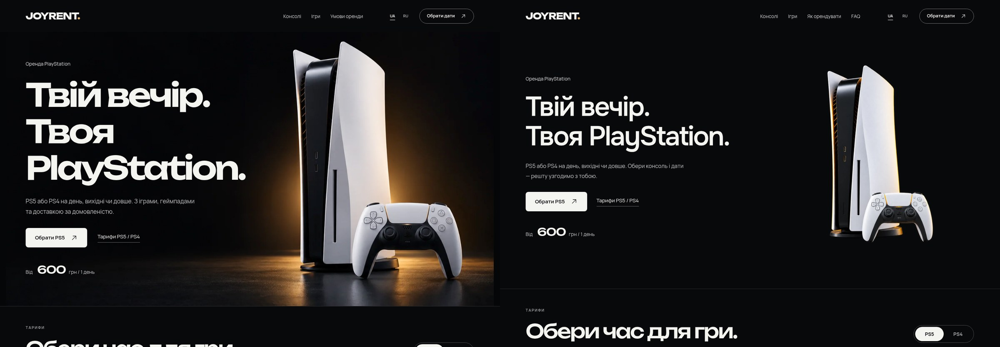
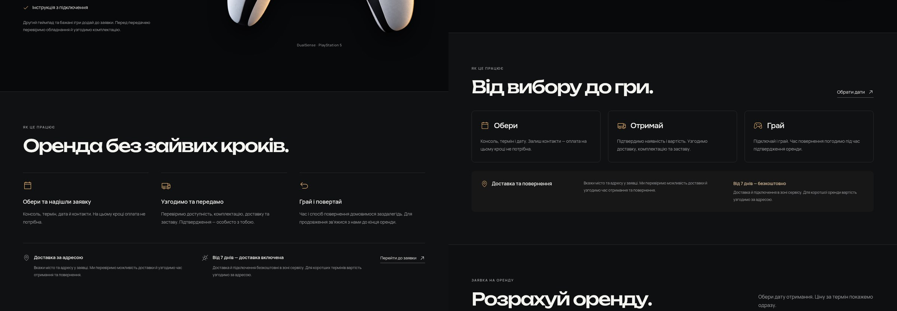
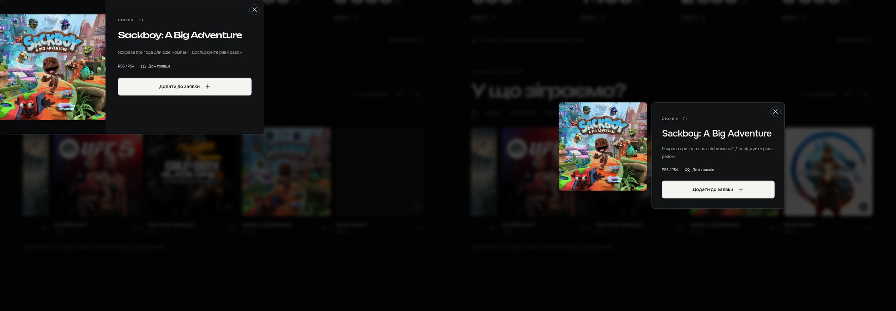

# JOYRENT 1.2 — главный экран, анимации и FAQ

Обновление по новым замечаниям пользователя. На хостинге остаётся установленная владельцем версия; эти материалы сняты с работающей локальной темы WordPress, а не с макета.

## Главный экран

Новая фотография целых PS5 + DualSense на прозрачном фоне, без прямоугольных краёв. Янтарный свет сохранён, заголовок стал читаемее: Onest и две строки. WebP изображения — 83 КБ. Слева в сравнении версия 1.1, справа 1.2; одинаковый viewport 1440×1000 и украинский язык.

[ПК, 1440 px](hero-1440-uk.png) · [Широкий экран, 3355 px](hero-3355-uk.png) · [Телефон, UA](hero-390-uk.png) · [Телефон, RU](hero-390-ru.png) · [Запись движения света](hero-motion.webm)

## DualSense и аренда

Полное изображение геймпада сохранено. Движение стало более плавным: небольшой подъём и поворот с циклом 12 секунд. Тёплая подсветка мягко меняется. При системной настройке уменьшения движения оба эффекта останавливаются.

[Геймпад на ПК](kit-1440-uk.png) · [Запись анимации](dualsense-motion.webm)

Вместо длинных пояснений — три этапа «Обери → Отримай → Грай», затем компактные условия доставки. На телефоне блоки идут последовательно.

## Окно игры

Окно открывается по центру. Обложка сохраняет размер из карточки и исходные пропорции, без увеличения при наведении или открытии. Окно подстраивается под изображение; пустых полос внутри него нет. При недостатке места описание переносится ниже. При переходе к более узкому viewport изображение может уменьшиться, чтобы оставаться в пределах экрана.

[ПК](dialog-1440.png) · [Телефон](dialog-390.png) · [320 px](dialog-320.png)

## Меню и отдельный FAQ

FAQ удалён с главной и доступен на отдельных страницах `/faq/` и `/faq-ru/`. Меню/подвал ведут в соответствующий язык. Ответы редактируются в WordPress как обычные страницы. Существующие страницы владельца при обновлении не заменяются. На FAQ работает нативный аккордеон без React.

[FAQ на ПК](faq-1440-uk.png) · [FAQ на телефоне](faq-390-uk.png) · [Открытый ответ, RU](faq-open-390-ru.png) · [Мобильное меню](menu-390-uk.png)

Мобильное меню закрывается по Escape, нажатию вне меню и при переходе к ПК; фокус возвращается к переключателю после Escape. Нижняя панель аренды не перекрывает hero и скрывается рядом с формой.

## Проверки

- 11 ширин: 320, 360, 390, 430, 768, 1003, 1280, 1440, 1920, 2560, 3355 px; без горизонтального выхода за viewport.
- Диалоги: шесть размеров, включая короткий экран 844×390; сохранение размера обложки, пропорций, центрирование, доступные действия и возврат фокуса. Переход открытого окна 700→701→768→390→1440 тоже проверен.
- UA/RU, сохранение выбора и формы, юридические окна, FAQ/возврат к заявке, ошибки сети и повторный идентификатор отправки.
- Реальная тестовая заявка WooCommerce только на локальном стенде, без оплаты; 16 тестов расчёта.
- Обычная анимация, неизменная ширина геймпада, динамическое переключение reduced motion.
- PHP lint, TypeScript/Vite, три установочных архива, независимый review.

[Установка обновления](../INSTALL.md) · [Дизайн QA](../../design-qa.md)
