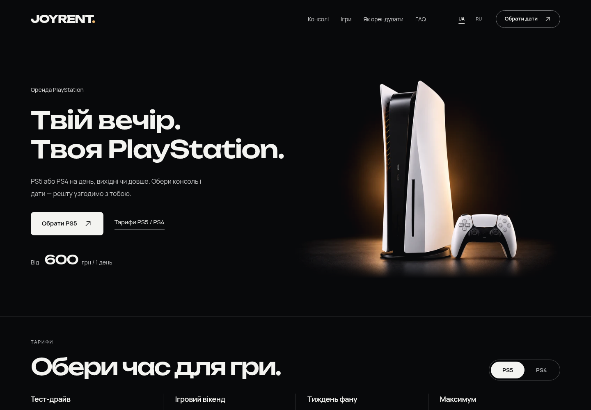

# JOYRENT1.4.1 — более крупная PS5

PS5 на ПК стала примерно на четверть крупнее и немного ближе к тексту. Для этого ImageGen подготовил более крупный план в прежней чёрной студии с мягким янтарным светом, матовым полом и одним DualSense. На телефоне прежняя сцена увеличена ровно на12%.

[Тема1.4.1 — ZIP](../../releases/joyrent-1.4.1.zip) · [Статический просмотр](../../releases/joyrent-preview-1.4.1.zip) · [Как заменить тему](../INSTALL.md)

[Телефон UA](hero-390-uk.png) · [Телефон RU](hero-390-ru.png) · [До/после ПК](comparison-hero-desktop.jpg) · [До/после телефон](comparison-hero-mobile.jpg) · [Деталь сцены](scene-detail.png)

Колонки, шрифт, кнопки, цена и высота первого экрана сохранены. Изображение увеличивается внутри прежнего зарезервированного `figure`: консоль, основание и геймпад полностью видны. Нижний край освещённого пола плавно исчезает в фоне. PS5 остаётся статичной; короткое появление текста и reduced motion сохраняются.

## Файлы и резкость

- `src/styles.css`: размер/положение `picture`, зарезервированный размер сцены и мягкое затухание пола.
- `wordpress/joyrent/assets/images/hero-media.json`: новые файлы ПК и `sizes` для увеличенного изображения; та же конфигурация используется PHP preload и React.
- `ps5-commercial-desktop-close.png`: новый нативный мастер1448×1086 без искусственного увеличения.
- `ps5-commercial-desktop-close.webp` и `ps5-commercial-desktop-close-768.webp`: WebP, подготовленные Sharp. Мобильные WebP сохранены.
- Номер темы/сборки обновлён до1.4.1. Плагин, механика аренды, тарифы, игры, FAQ и остальные секции не менялись.

[Размеры, веса и SHA-256](asset-manifest.json). На самом широком экране фотография ПК занимает примерно701CSSpx, поэтому нативные1448px покрывают DPR2. На мобильном максимум493CSSpx, источник1120px также покрывает DPR2. [ПК Retina](hero-1440-retina.png) · [Телефон Retina](hero-390-retina.png).

## Проверка

[41 сценарий](hero-viewport-results.json): 19 размеров UA/RU, включая1366/1440/1600/1920/3355,360/375/390/414/430, границу900/901 и короткий844×390; три случая DPR2. Проверены полные силуэты, отсутствие переполнения/пересечения с текстом, один подходящий запрос из preload и нативная плотность источников. Максимальный CLS обычной локальной загрузки меньше0.001; это не production Core Web Vitals.

`npm test`16/16, TypeScript/Vite и PHP lint проходят. Архивы темы/preview целостны и содержат новый кадр/конфигурацию; PNG-мастер в ZIP не включён. Плагин1.3 и metadata зависимостей не менялись. Финальные сравнения включают исправление первоначально слишком резкого нижнего края пола.

На опубликованный хостинг обновление не загружалось. Замените только тему ZIP и очистите кэш; плагин1.3 повторно устанавливать не нужно.

[Независимая финальная проверка](independent-summary.json) · [Проверка CTA](independent-cta-results.json) · [Design QA](../../design-qa.md)
