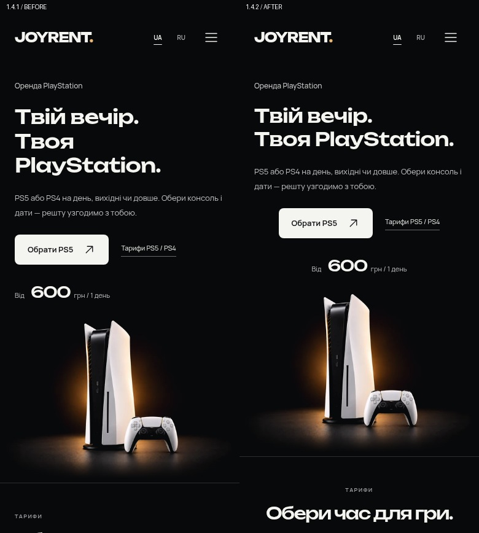
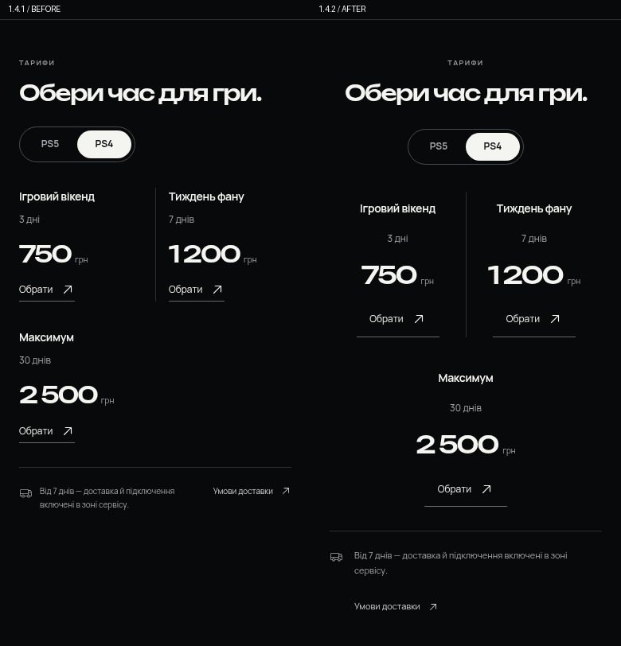
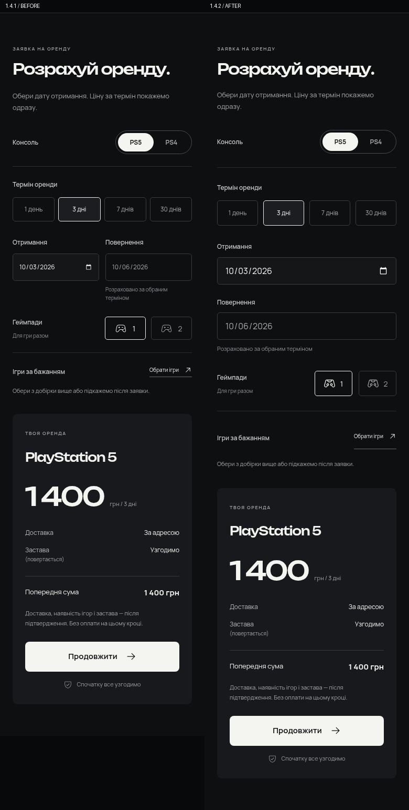

# JOYRENT 1.4.2 — мобильная адаптация

[Тема 1.4.2](../../releases/joyrent-1.4.2.zip) · [Визуальный просмотр](../../releases/joyrent-preview-1.4.2.zip) · [Проверка Product Design](design-qa.md)

- Заголовок в две строки на телефоне, CTA/тарифы и цена по центру.
- Содержимое тарифов и переключатель консолей выровнены по центру. PS4: третий тариф по центру второго ряда.
- Поля дат на телефоне стоят друг под другом; отступы увеличены. Узкие экраны 320–375 px получают два ряда выбора срока.
- Иконка [Iconoir PlayStation Gamepad](https://github.com/iconoir-icons/iconoir/blob/main/icons/regular/playstation-gamepad.svg) с сенсорной панелью и двумя стиками используется во всех местах. Лицензия MIT включена в тему.

[Первый экран](hero-390-uk.png) · [Тарифы PS5](rates-ps5-390-uk.png) · [Тарифы PS4](rates-ps4-390-uk.png) · [Форма](booking-390-uk.png) · [Русская версия](hero-390-ru.png) · [ПК](hero-1440-uk.png)

26 двуязычных сценариев 320–1920 px,182 выбора тарифов, редактирование даты/количества геймпадов и контактные поля: [результаты](responsive-results.json). Дополнительно пройдены16 unit-тестов и существующие браузерные проверки до3355px с настоящей заявкой локального WooCommerce. ОшибокJS и горизонтального переполнения нет.

Проверка Safari не выполнена: загрузка WebKit заблокирована сетевой политикой окружения. Изменения внесены с учётом нативных iOS полей дат, но реальные результаты Safari не заявляются.

Для обновления стенда замените только тему и очистите кэш. Плагин 1.3, цены, заявки и настройки сохранены. Хостинг в этой итерации не изменён.
