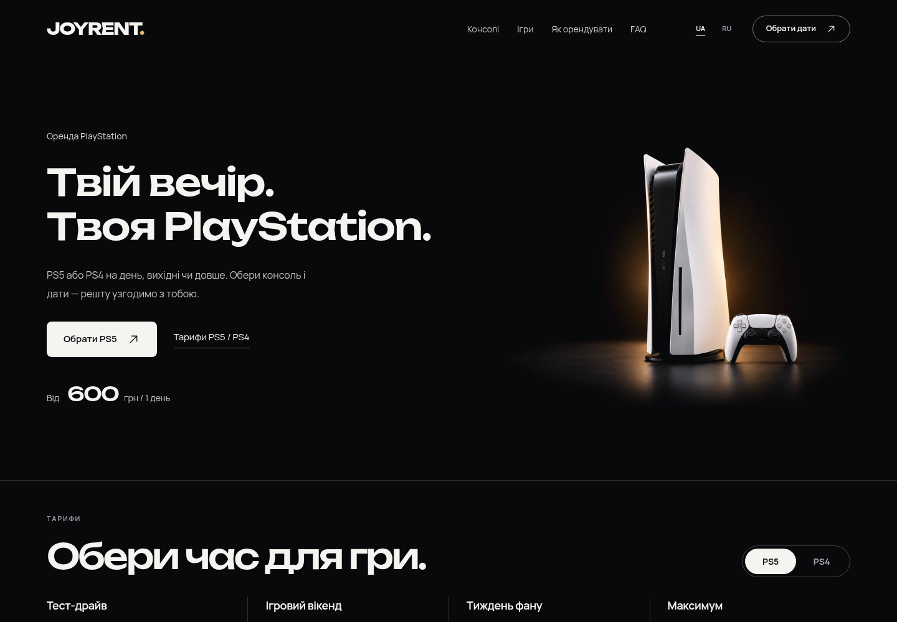

# JOYRENT 1.4 — главный экран

PS5 теперь стоит в самостоятельной правой колонке, а текст — в спокойной левой. Новая фотография сохраняет чёрную студию и янтарный свет, но поверхность стала матовой, отражение короче, геймпад — пропорциональнее. Это обновление темы; плагин аренды остаётся версии 1.3.

[Тема 1.4 — ZIP](../../releases/joyrent-1.4.0.zip) · [Визуальный просмотр](../../releases/joyrent-preview-1.4.0.zip) · [Обновление стенда](../INSTALL.md)

[Телефон UA](hero-390-uk.png) · [Телефон RU](hero-390-ru.png) · [Retina ПК](hero-1440-retina.png) · [Retina телефон](hero-390-retina.png)

## Композиция и адаптация

- ПК: сетка примерно 52/48, отдельный зазор, ограничение полезной ширины 1536 px. Консоль целиком, с основанием и одним DualSense впереди. Кадр не растянут фоном на весь hero.
- Изображение 4:3 показывается целиком. Затемнение краёв и смешивание с чёрным фоном убирают границу фотографии; свет и пол присутствуют в сгенерированном кадре.
- Телефон до 900 px: подпись, заголовок, описание, действия и цена, затем отдельная мобильная сцена. Она ограничена 440 px и центрирована. На 390 px высота hero уменьшилась примерно с 804 до 688 px.
- Unbounded 550 сохранён. Две строки на ПК, три на небольших телефонах. Место под текст и изображение зарезервировано, в том числе на время загрузки локальных шрифтов.
- PS5 статична. У заголовка короткое проявление букв с небольшим blur/сдвигом; reduced motion показывает текст сразу. Бесконечный слой дублированной фотографии удалён. Мягкая анимация геймпада в блоке комплекта сохраняется.

## Изображения

Созданы два самостоятельных кадра **ImageGen**, а не прозрачная вырезка на CSS-подсветке. **Sharp** использован только для уменьшения и WebP-кодирования. PNG-мастера сохранены в исходниках, установочные ZIP содержат WebP.

| Файл в `wordpress/joyrent/assets/images/` | Размер | Назначение |
|---|---|---|
| `ps5-commercial-desktop.png` | 1448×1086, исходное разрешение генератора | Мастер ПК |
| `ps5-commercial-desktop.webp` | 1448×1086 | Retina ПК |
| `ps5-commercial-desktop-768.webp` | 768×576 | Обычный экран ПК |
| `ps5-commercial-mobile.png` | 1448×1086, исходное разрешение генератора | Отдельный мобильный мастер |
| `ps5-commercial-mobile.webp` | 1120×840 | Плотный мобильный экран |
| `ps5-commercial-mobile-560.webp` | 560×420 | Обычный мобильный экран |

[Точные размеры, веса и SHA-256](asset-manifest.json). Полный кадр ПК занимает около 62 KB, мобильный — 48 KB; малые варианты — около 16 и 11 KB. В `hero-media.json` хранится единая конфигурация `picture` и серверного preload: браузер загружает только применимый кадр. У изображения eager/high priority, явные размеры и responsive `srcset`/`sizes`.

Нативные мастера не увеличивались искусственно до 2K/4K. 1448 px покрывает двукратную плотность при максимальной отрисовке ПК около 638 px; DPR2 проверен. Для большей плотности на крупных экранах пределом остаётся исходное разрешение генератора.

## Что взято из 21st.dev

Изучены два актуальных паттерна:

- [Blur Fade](https://21st.dev/@dillionverma/components/blur-fade): короткое, однократное проявление текста. Реализовано CSS в существующем компоненте.
- [Radial Glow Background](https://21st.dev/@meghtrix/components/radial-glow-background/emerald-radial-glow-bg): принцип мягкого затухания света использован в арт-направлении ImageGen, с янтарным цветом JOYRENT.

Компоненты целиком не импортировались. Новые зависимости не добавлены; существующая архитектура WordPress/React сохранена. Использованы Product Design для сравнения и проверки, Chromium/Playwright для реального рендера WordPress.

## Изменённые файлы

| Файл | Изменение |
|---|---|
| `src/sections/Hero.tsx` | Самостоятельный `figure/picture` внутри сетки, responsive источники; исходные CTA, цена и тексты сохранены |
| `src/styles.css` | Последний hero-блок: колонки, размеры, blending, переносы, резервирование текста и reduced motion |
| `components/ui/blurred-stagger-text.tsx` | Тот же интерфейс компонента; короткая нативная CSS-анимация вместо Motion |
| `wordpress/joyrent/functions.php` | Responsive preload только на главной, ранняя загрузка двух используемых подмножеств Unbounded |
| `wordpress/joyrent/assets/images/hero-media.json` | Общая конфигурация React/PHP для выбора и preload изображения |
| `wordpress/joyrent/style.css`, `package.json`, `package-lock.json` | Версия темы/сборки 1.4; metadata зависимостей сохранена |
| `scripts/package.mjs` | Имя ZIP плагина берётся из его собственной версии, чтобы hero-обновление не маркировало плагин как 1.4 |
| `tests/integration/browser.py`, `polish-browser.py` | Проверка статичной PS5/появления текста и сохранённых функций; временные снимки вне исторических отчётов |

Шапка, тарифы, игры, их окна, FAQ, подвал, форма и код плагина не менялись. Данные магазина не переписываются.

## Проверка

[Замеры 46 сценариев](hero-viewport-results.json): 19 размеров UA и RU, три случая DPR2 и пять сценариев с задержанными шрифтами. Среди размеров: 1366/1440/1600/1920/3355 и 360/375/390/414/430; также 320, 480/481, 900/901 и 844×390. Проверены отсутствие горизонтального переполнения, правильный источник и единственный запрос изображения из preload.

В обычной локальной загрузке максимальный CLS по 41 сценарию — 0.00032. На 390 и 1440 px локальный LCP составлял примерно 0.33–0.39 с, запрос изображения начинался из `<head>` через 63–126 мс. При искусственной задержке всех шрифтов кнопки hero остаются на месте; общий CLS страницы 0.005–0.011 включает неизменённые соседние элементы. Это замеры локального стенда без ограничения сети, **не гарантия показателей опубликованного сайта**.

- `npm test`: 16/16; TypeScript/Vite и сборка ZIP проходят.
- `browser.py`: переключение PS5/PS4, даты, фильтр/лента/окно игры, возврат фокуса, согласие и настоящая тестовая заявка в локальном WooCommerce; мобильное меню, нет ошибок JS или HTTP.
- `polish-browser.py`: UA/RU сохраняет форму/игру/согласие, локализованные ошибки и повтор с тем же requestId; 12 обложек загружаются. Проверены завершение текста, статичная PS5, плавный геймпад и reduced motion.
- Все 16 PHP-файлов проходят lint. Тема и preview проходят проверку ZIP; содержимое плагина 1.3 байтово идентично прежнему.
- Независимый review после исправлений: нет оставшихся P0/P1/P2.

[До/после ПК](comparison-hero-desktop.jpg) · [До/после телефон](comparison-hero-mobile.jpg) · [Сравнение фотографий](comparison-studio-assets.jpg) · [Деталь текста](headline-detail.png) · [Деталь сцены](scene-detail.png)

[Запись появления — ПК](hero-entrance-desktop.webm) · [Телефон](hero-entrance-mobile.webm) · [Design QA](../../design-qa.md)

Опубликованный хостинг этим обновлением не изменён. Для стенда с установленной 1.3 достаточно заменить тему ZIP и очистить кэш; плагин повторно загружать не требуется.
