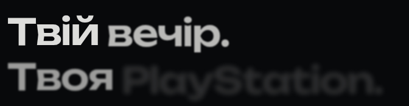

# JOYRENT 1.5 — тарифы, доставка и игры

[Тема 1.5.0](../../releases/joyrent-1.5.0.zip) · [Плагин 1.5.0](../../releases/joyrent-rentals-1.5.0.zip) · [Визуальный просмотр](../../releases/joyrent-preview-1.5.0.zip) · [Установка](../INSTALL.md)

В этой версии обновляются **оба архива**, тема и плагин. После замены очистите кэш WordPress/хостинга/CDN. Опубликованный стенд flowers-luxury.shop этой работой не изменён.

## Что изменилось

- Удалён повторный блок «Вечір починається з вибору» перед подвалом.
- Доставка оформлена самостоятельной панелью: адрес и получение слева, условия доставки и подключения справа. На телефоне части стоят друг под другом.
- «Обрати / Выбрать» — полноценные контурные кнопки. Вместо прямых стрелок используются тонкие шевроны в мягких кругах; при наведении контур немного теплеет.
- Бесплатная доставка показана внутри тарифов на 7 и 30 дней. Под тарифами осталась одна ссылка на условия получения.
- Заголовок появляется плавно, по словам, с коротким размытием. Две строки сохраняются в UA/RU; reduced motion показывает текст сразу. Эффект адаптирован из предоставленного пользователем [Blurred Stagger Text](https://21st.dev/@preetsuthar17/components/blurred-stagger-text), без новых зависимостей.
- Общая иконка контроллера заменена на оригинальный контур JOYRENT с широкой сенсорной панелью и симметричными стиками. Фотография DualSense и мягкое движение/свет сохранены.
- В подборке 20 игр с официальными обложками. Первые позиции: FC 27, GTA V, Mortal Kombat 1, S.T.A.L.K.E.R. 2, UFC 6, Tekken 8, Split Fiction и It Takes Two. Порядок редактируется в WordPress через «Атрибути → Порядок».
- Hover аккуратно поднимает всю карточку игры на 5px. Изображение не масштабируется; открытый диалог сохраняет ширину обложки, без зума, обрезки и чёрных полос.

Плагин добавляет отсутствующие записи новых игр и один раз задаёт начальный порядок. По указанию владельца тестового сайта **FC 25, UFC 5 и Black Ops 6 удаляются из записей игр**, без сохранения черновиков. Другие авторские описания, свои обложки, существующие черновики и корзина, цены, настройки и заказы сохраняются. Подборка — пожелания к заявке: наличие лицензии и конкретного издания подтверждает магазин.

## Главный экран и движение

[Телефон 390px, UA](first-screen-390-uk.png) · [Телефон 320px, UA](first-screen-320-uk.png) · [Телефон, RU](first-screen-390-ru.png) · [Мобильное меню](menu-390-uk.png)

GIF повторяется для просмотра. На сайте появление проигрывается один раз при открытии главного экрана; при reduced motion анимации нет.

## До и после

Одинаковая локальная установка WordPress, UA, DPR1, ширина 390 или 1440 CSSpx, PS5, 3 дня, один геймпад. Слева — выпущенная 1.4.2, справа — 1.5.0. Компоненты сняты без изменения масштаба; разная высота отражает новые отступы. Панель доставки на ПК стала на 2px шире из-за своего нового контура.

| Блок | ПК | Телефон |
|---|---|---|
| Доставка | [Сравнение](comparison-delivery-1440.jpg) | [Сравнение](comparison-delivery-390.jpg) |
| Тарифы PS5 | [Сравнение](comparison-rates-1440.jpg) | [Сравнение](comparison-rates-390.jpg) |
| Каталог игр | [Сравнение](comparison-games-1440.jpg) | [Сравнение](comparison-games-390.jpg) |

[Весь блок получения на ПК](delivery-1440-uk.png) · [На телефоне](delivery-390-uk.png) · [Тарифы PS4, телефон](rates-ps4-390-uk.png) · [Тарифы PS5, 320px](rates-ps5-320-uk.png) · [Конец страницы без CTA](page-end-1440.png)

## Игры и форма

[Карточка при наведении](games-hover-1440.png) · [Окно FC 27](game-dialog-fc27-1440.png) · [Окно S.T.A.L.K.E.R. 2 на телефоне](game-dialog-stalker2-390.png) · [Форма на телефоне](booking-390-uk.png) · [Новая иконка, реальный размер](controller-icon-native.png)

[Проверка версий и порядок игр](catalog-research.md) · [Источники обложек](../game-artwork-sources.json) · [Product Design QA](design-qa.md) · [Замеры адаптации](layout-results.json) · [Замеры движения и диалогов](interaction-results.json)

Проверены 32 сочетания ширины 320–3355px и языка, 224 выбора тарифов, все поддерживаемые игры и диалоги в UA/RU на 390/1440px, настоящая локальная заявка WooCommerce и повтор без нового заказа. Все 16 unit-тестов, 15 PHP-проверок предметной логики и 14 проверок миграции прошли. ZIP и PHP syntax проверены. Safari не запускался: загрузка WebKit недоступна в окружении; мобильные скриншоты сделаны Chromium с touch-эмуляцией.
