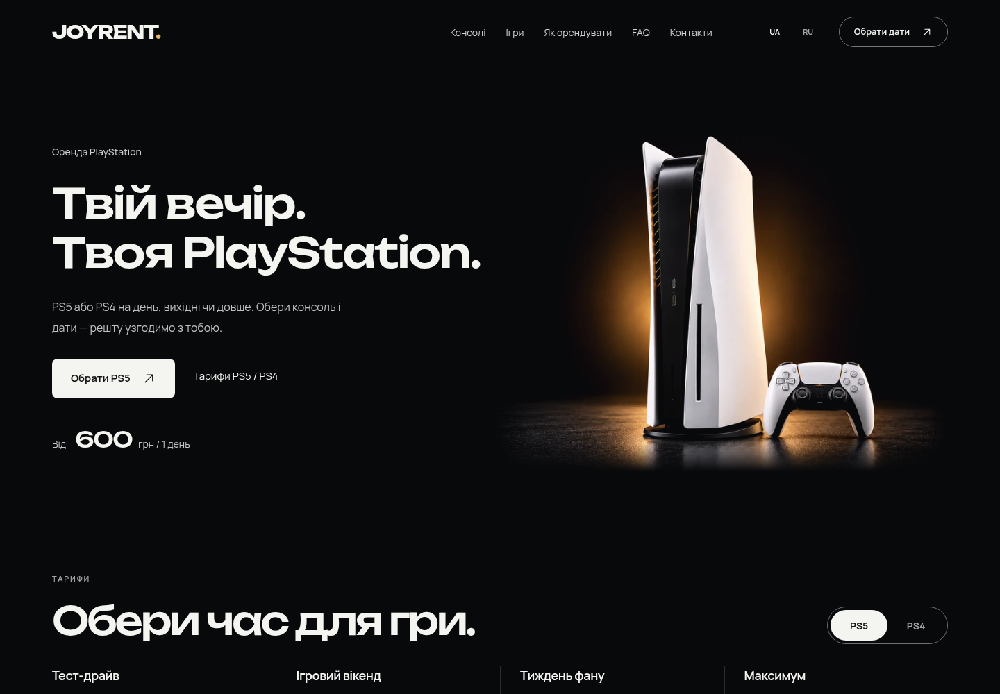

# JOYRENT 1.6 — исправления заявки, каталог и доставка по Одессе

Выполнены согласованные этапы [аудита 1.5](../audit-1.5-2026-10-03/README.md): надёжная форма и каталог, связанный выбор игр, мобильное резюме, карта доставки и responsive-изображения. Чёрная студия, янтарный свет, полные силуэты PS5/DualSense, двухстрочный Unbounded и семь цен сохранены. Подготовлены [тема](../../releases/joyrent-1.6.0.zip), [плагин](../../releases/joyrent-rentals-1.6.0.zip) и [статический просмотр](../../releases/joyrent-preview-1.6.0.zip); установка — [по инструкции](../INSTALL.md). Опубликованный хостинг этим выпуском не изменён.

[Главная RU на телефоне](screens/ru-mobile-hero.png) · [Редактируемое резюме UA](screens/ua-mobile-booking-recap.png) · [Выбор игр RU](screens/ru-mobile-game-picker.png) · [Все выбранные экраны](#экраны)

## Заявка и каталог

- Continue и Submit имеют отдельные стабильные DOM-кнопки. Первый переход не проверяет пустые контакты; «Назад → Далее» не отправляет заявку. Проверка контактов выполняется при явной отправке.
- Загрузка, ошибка и повтор каталога видны до отправки. Уникальные ID нормализуются на сервере и клиенте; выбор сверяется с обновлёнными играми и выбранной консолью. Пустые каталоги и отсутствующие отдельные тарифы безопасны.
- UI/REST используют одну границу: до 100 уникальных опубликованных игр, с настраиваемым лимитом 1–100. При достижении лимита Add выключен и объяснение находится в текущем диалоге; уже выбранную игру можно убрать.
- BO7: PS5 — до двух локальных игроков, PS4 — один; нужен интернет. GT7: PS5 — до четырёх, PS4 — до двух. Фильтры совместной игры и подписи следуют выбранной платформе. Доступность лицензии и сетевых режимов подтверждает магазин.
- Миграции защищены от параллельного запуска. Авторские тексты, изображения, поля, статусы и приоритеты сохраняются; автоматическая очистка ограничена доказанными неизменёнными управляемыми записями.
- После сохранения заказа отправляется одно уведомление магазина. Конкурентный повтор не создаёт второй заказ/письмо; неудачное уведомление можно повторить из админки. Приватное поле **«Одержувач сповіщень (лише для адміністратора)»** (`notification_email`) не выдаётся в публичном REST/boot и не включено личным адресом в исходники или архивы. На хостинге его заполняют отдельно.

Подборка игр открывается рядом с формой в нативном диалоге и возвращает фокус/позицию. На телефоне контактный шаг показывает компактное редактируемое резюме, а нижняя панель — текущие консоль, срок и цену. Важные пояснения и согласие — 13px, поля имеют более различимый контур; небольшие действия сохраняют 44px области нажатия.

Черновик действует **30 минут в текущей сессии** и хранит только консоль, срок, дату, игры, геймпады, способ получения и шаг. Имя, телефон, адрес и согласие остаются в памяти формы. После полной перезагрузки контакты заполняются снова; после успешной отправки черновик удаляется. FAQ и полные правила сохраняют выбор аренды при возврате.

## Одесса и условия магазина

Публичные контакты: [+380996669946](tel:+380996669946) и [@joyrent_od](https://t.me/joyrent_od). Публичный email не задан; приватный адрес уведомлений с ним не смешивается. Пункт «Контакты» в шапке/мобильном меню ведёт к существующему подвалу с этими каналами. Один или два геймпада — бесплатно по выбору. Залог **PS4 — 7 500 грн**, **PS5 — 25 000 грн** хранится отдельно и не добавляется к сумме заявки. Сайт не списывает оплату и не резервирует наличие автоматически.

Карта использует точные исходные географические зоны Funbox, согласованные владельцем: **один зелёный, два жёлтых и три красных полигона**. Все шесть геометрий сохранены координата в координату, включая кольца; зоны не перерисованы по скриншоту и не заменены прямоугольниками. [Публичная геометрия и источник](../../wordpress/joyrent-rentals/data/delivery-zones.json). Маркера или брендинга другого оператора нет.

| Зона | Доставка и возврат вместе | От семи дней |
|---|---|---|
| Зелёная | 200 грн | Бесплатно после подтверждения зоны |
| Жёлтая | 300 грн | Бесплатно после подтверждения зоны |
| Красная | По тарифу такси | По тарифу такси |
| Граница / вне зон | Подтверждает магазин | Подтверждает магазин |

Неизвестный адрес остаётся **ожидающим согласования доставки**, включая аренду на семь/тридцать дней. Предварительная сумма включает только известные суммы; условное «Включено» относится к зелёной/жёлтой зоне. Поиск адресов, геолокация и отправка адреса картографическому провайдеру не используются.

Стиль сверён с [mapcn / MarkerContent](https://21st.dev/@mapcn/components/mapcn-marker-content) и его поддержкой GeoJSON. [Проверенные ссылки](evidence/map-references.md). Реализация Leaflet написана независимо; код ссылок без лицензии не копировался. Leaflet BSD-2-Clause включён в тему. Стандартные OpenStreetMap тайлы загружаются после открытия карты с видимой атрибуцией. При недоступности тайлов остаются точные локальные контуры; при отказе lazy-библиотеки — локальная SVG-схема. Снимки ниже показывают именно эту схему: внешние тайлы в приёмке блокировались. Реальная загрузка уличной подложки на хостинге ещё требует проверки.

Стандартные WooCommerce frontend-скрипты отключены только на заявочной главной; прочие маршруты магазина сохраняют свои скрипты. WordPress подключает уже хешированный JS без дополнительного `?ver`: lazy-import использует тот же canonical URL и не запускает вторую React-корневую загрузку. Эти исправления проверены на упакованной локальной странице.

## Изображения и загрузка

Desktop PS5 получил **реальный ImageGen edit native 1448×1086**: сохранены композиция и силуэты, добавлены видимые детали стиков/портов. Файл не увеличен искусственно. [Нативные crops и метаданные](evidence/desktop-detail.json) сравнивают одинаковые координаты без увеличения/резкости: [геймпад до](evidence/controller-beforeWebp.png) / [после](evidence/controller-afterWebp.png), [порты до](evidence/ports-beforeWebp.png) / [после](evidence/ports-afterWebp.png).

Мобильный WebP 1448px покрывает сцену на 390px при DPR3. Максимальная desktop-сцена около 701px при DPR3 требует **2104px+**: native 1448px покрывает **68,8%** требования. F16 закрыт по реальным деталям и мобильному файлу, но полностью закрыть большой desktop DPR3 пока нельзя. Масштабирование файла не выдаётся за новый исходник.

Обложки используют 360/720px варианты; оригиналы открываются в диалоге без зума/рамки. Дальние карточки не получают image src до приближения к области просмотра. DualSense имеет 560/1120px варианты; React и PHP используют один hero-manifest. Анимация остаётся короткой/мягкой, reduced motion останавливает движение.

Контролируемое сравнение свежих Chromium-контекстов с 1.5 показало снижение **только WebP-байтов первого экрана на 61,5–97,4%**. Это не Lighthouse и не замер опубликованного сайта: исключены JS/CSS/HTML/шрифты; использованы одинаковые последовательности секций и исходные обложки. [Сетевые данные](evidence/image-network-before-after.json):

| Ширина / DPR | 1.5 → 1.6, первый экран | Снижение |
|---|---:|---:|
| 390 / 1 | 444 922 → 11 462 B | 97,4% |
| 390 / 3 | 481 706 → 74 314 B | 84,6% |
| 1440 / 1 | 965 662 → 184 246 B | 80,9% |
| 1440 / 3 | 1 025 580 → 394 766 B | 61,5% |

## Проверка

- Основной Vitest-набор: **42 проверки проходят**; `vitest.config.ts` включает только `src/` и `components/`. Старые 16 scratch/baseline тестов не считаются новыми проверками 1.6. TypeScript/Vite/package пройдены; отдельная проверка синтаксиса всех 17 PHP-файлов также проходит. [Проверка выпуска](evidence/release-validation.json) подтверждает целостность трёх ZIP и byte-for-byte соответствие извлечённых файлов сборке, согласованные публичные условия и отсутствие личного email в архивах/публичном GET.
- Локальный WordPress/WooCommerce: [50 backend-проверок](evidence/backend-green.json), **26 проверок настроек** после добавления согласованных публичных контактов, 14 миграции каталога и 15 доменных правил. [13 регрессий независимого review](evidence/backend-review-green.json) и [33 проверки условий доставки](evidence/delivery-zone-green.json) проходят после точечных исправлений.
- [Шесть конкурентных работников](evidence/backend-concurrency.json): 20/20 уникальных игр, один заказ и **одна перехваченная попытка письма**; повтор возвращает тот же заказ. Перехват `pre_wp_mail` не доказывает доставку реального письма на хостинг.
- [Итоговый integration review](evidence/review-integration-final.md) и [map review](evidence/review-map-final.md) проверяют финальные согласованные условия и исправления.
- [Независимый backend review](evidence/review-backend-final.md) и [frontend review](evidence/review-frontend-final.md) закрыли найденные Important замечания. [Capacity до](evidence/frontend-capacity-red.json) / [после](evidence/frontend-capacity-green.json), [читаемость согласия](evidence/frontend-consent-narrow.json).
- Отдельные media/map-пробы подтверждают native-размеры, две строки заголовка, reduced motion, точную геометрию, панорамирование/масштабирование, Escape и возврат фокуса. Геометрия/движение: [JSON](evidence/geometry.json), [motion](evidence/motion.json).
- Итоговая браузерная приёмка: **76 сценариев проходят, 0 отказов**. Это актуальный последний результат каждого сценария: 46 базовых сценариев с точечными повторами изменённых состояний, 18 дополнительных и 12 проверок шапки/контактов. Все 76 не запускались одним проходом на последней сборке. Проверены UA/RU, 320/390/768/1440/1920px, normal/reduced motion, форма/Enter/черновик после успеха, диалоги, карта и мобильная цена. Последние выбранные снимки сняты с финальной упакованной страницы (`main-Dm7Og9CV.js` / `main-CNG164Kn.css`). [Отчёт приёмки](evidence/browser-report.md) · [JSON](evidence/browser-report.json).

Физический iPhone/Safari, фактическая доставка уведомления и загрузка внешней уличной подложки на установленном хостинге не проверены. Локальная Chromium-эмуляция не объявляется Safari-проверкой. Личные настройки/адреса получателей и сырые письма в доказательства не включены.

## Экраны

Свежие выбранные снимки упакованной UA/RU страницы: телефон 390×844 и ПК 1440×1000. Контактные поля пустые; реальные персональные данные отсутствуют. Браузерные POST-проверки перехватывались до передачи серверу; настоящие клиенты и почта хостинга не затрагивались.

| Состояние | UA | RU |
|---|---|---|
| Главная, телефон | [UA](screens/ua-mobile-hero.png) | [RU](screens/ru-mobile-hero.png) |
| Главная, ПК | [UA](screens/ua-desktop-hero.png) | [RU](screens/ru-desktop-hero.png) |
| Контактное резюме, телефон | [UA](screens/ua-mobile-booking-recap.png) | [RU](screens/ru-mobile-booking-recap.png) |
| Пустые контакты, ПК | [UA](screens/ua-desktop-booking-empty-contacts.png) | [RU](screens/ru-desktop-booking-empty-contacts.png) |
| Подбор игр, телефон | [UA](screens/ua-mobile-game-picker.png) | [RU](screens/ru-mobile-game-picker.png) |
| Подбор игр, ПК | [UA](screens/ua-desktop-game-picker.png) | [RU](screens/ru-desktop-game-picker.png) |
| Локальная схема доставки, телефон | [UA](screens/ua-mobile-delivery-map.png) | [RU](screens/ru-mobile-delivery-map.png) |
| Локальная схема доставки, ПК | [UA](screens/ua-desktop-delivery-map.png) | [RU](screens/ru-desktop-delivery-map.png) |

Статусы этапов и оставшиеся внешние проверки — в [implementation.md](implementation.md). История 1.5 и более ранних версий сохранена в основном README.
