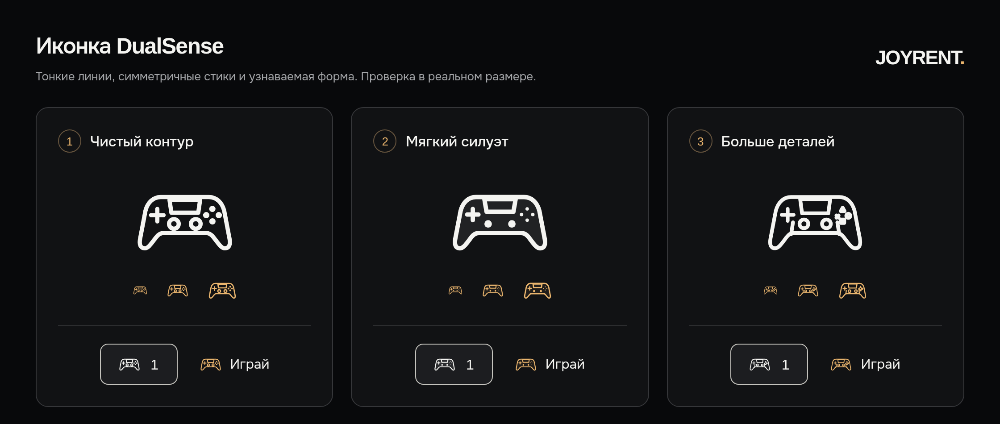

# JOYRENT 1.7 — уточнение дизайна и текста

[Тема 1.7.0](../../releases/joyrent-1.7.0.zip) · [Плагин 1.7.0](../../releases/joyrent-rentals-1.7.0.zip) · [Статический preview](../../releases/joyrent-preview-1.7.0.zip) · [Установка](../INSTALL.md)

Релиз обновляет существующую главную UA/RU, сохраняя чёрный фон, белую типографику, мягкий янтарный свет, двухстрочный Unbounded и семь согласованных цен. Форма и ручное подтверждение аренды сохраняются. На опубликованный хостинг изменения этой работой не загружались.

## Что изменено

- Hero получил спокойную округлую основную кнопку с короткой стрелкой; на телефоне она компактнее. Телефон и Telegram в подвале размещены в одной строке с доступными областями нажатия на главной и страницах FAQ, условий и конфиденциальности. Публичные ссылки: [+380996669946](tel:+380996669946) и [@joyrent_od](https://t.me/joyrent_od).
- Три этапа аренды стали открытой последовательностью с тонким соединением: три колонки на ПК, вертикальная линия на телефоне. Содержание объясняет выбор, подтверждение и возврат без новых обещаний наличия.
- Блок доставки показывает лёгкое SVG-превью всех шести исходных географических полигонов Одессы. Подпись города локализована. Кнопка интерактивной карты имеет минимальную высоту 50px на ПК и 52px на телефоне; на телефоне она по центру. Карта по-прежнему загружается лениво и не классифицирует адрес автоматически.
- DualSense использует прежнюю оригинальную фотографию и responsive-варианты. Контролируемый поворот по yaw/roll и мягкий проход света останавливаются вне экрана и в скрытой вкладке; reduced motion показывает нейтральный оригинал без движущегося света. Изображение остаётся целиком, без масштабирования в анимации; подпись под ним удалена. [Отчёт Story](story-report.md).
- UA/RU исправлены в форме, тарифах, игре и picker: склонения геймпадов/локальных игроков, грамматика лимита игр, короткие ошибки и пустые состояния. Если показанное описание содержит точное известное предложение о требовании интернета, flag-note не повторяется; custom description без него сохраняет отдельную заметку. Одна общая оговорка рядом с условиями тарифов ограничивает «Доставка включена*» зелёной и жёлтой зонами. [Все рекомендации до/после](copy-audit.md).
- FAQ и стандартные управляемые legal/privacy тексты приводятся к согласованным условиям. Миграция заменяет только точные прежние опубликованные управляемые тексты с неизменённым заголовком и пустым excerpt. Условия с фиксированными суммами применяются лишь при совпадении настроек с согласованными условиями Одессы; при других настройках FAQ/правила остаются нейтральными. Авторские страницы/условия сохраняются. Приватный получатель уведомления остаётся отдельной администраторской настройкой. Длинные заголовки отдельных правовых страниц получили Onest размером 24–48px и защиту переноса на узких экранах; hero сохраняет двухстрочный Unbounded.

Условия сохранены: один или два геймпада без доплаты; залог PS4 — 7 500 грн, PS5 — 25 000 грн отдельно от цены аренды. Зелёная зона — 200 грн, жёлтая — 300 грн за доставку и возврат вместе; красная — тариф такси. От семи дней бесплатно только в подтверждённой зелёной/жёлтой зоне. Неизвестная стоимость доставки ожидает подтверждения и не добавляется к предварительной сумме. Для обновления нужны **тема и плагин 1.7.0**, затем очистка кэша.

## Варианты иконки

| Вариант | Материал |
|---|---|
| 1 — лёгкий контур | [a.svg](icons/a.svg) |
| 2 — мягкий силуэт | [b.svg](icons/b.svg) |
| 3 — больше деталей | [c.svg](icons/c.svg) |

Это реальные SVG-прототипы для выбора, показанные также в небольших размерах. Пользователь ещё не выбрал вариант. Общая иконка production остаётся из 1.6; таблица не означает, что три разные иконки внедрены на сайт.

## Референсы и исходные изображения

Изучены шесть конкретных страниц 21st.dev и их публичные статические превью. Они использованы как ориентиры композиции и движения, с самостоятельной реализацией на существующем стеке. Исходники компонентов с `no-license` или неизвестной лицензией не копировались; новые пакеты не устанавливались.

| Референс | Использованный принцип | Опубликованная лицензия |
|---|---|---|
| [Process Timeline](https://21st.dev/@shadcnui-blocks/components/timeline-05) | Открытые этапы, тонкая линия | no-license — только визуальный ориентир |
| [Minimal Two-Column Footer](https://21st.dev/@ln-dev7/components/footer-17) | Спокойная группировка контактов | MIT |
| [FlowButton](https://21st.dev/@xubohuah/components/flow-button) | Короткая подпись и связанная стрелка | MIT |
| [Texture Button](https://21st.dev/@cult-ui/components/texture-button) | Сдержанная глубина поверхности | MIT |
| [Reveal Image Mask](https://21st.dev/@daiwiikharihar/components/reveal-image-mask) | Одно мягкое появление изображения | Неизвестна — только визуальный ориентир |
| [Parallax Floating / Floating Card](https://21st.dev/@cnippet-dev/components/parallax-floating/floating-card) | Глубина через отдельные слои фото/света | no-license — только визуальный ориентир |

[Подробный reference audit](reference-audit.md) · [URL и metadata](reference-evidence.json). Статические превью не доказывают время анимации или поведение на всех ширинах: движение JOYRENT проверяется собственной браузерной пробой.

Фотографии PS5/DualSense и официальные обложки **в 1.7 не заменены**. Источники и ограничения PS5 из 1.6 сохраняются: desktop native 1448px, прежнее покрытие максимального DPR3 — 68,8%, для него нужен исходник 2104px+. Mobile PS5 1448px покрывает 390px/DPR3. Оригинальный прозрачный DualSense — 1536×1024. Прежнее контролируемое уменьшение загрузки 61,5–97,4% не объявляется новым Lighthouse-результатом 1.7. [История изображений 1.6](../refinement-1.6/README.md#изображения-и-загрузка).

## Проверка

Перед изменениями свежие read-only GET опубликованной 1.6 подтвердили совпадение frontend-assets с локальной финальной 1.6, 20 уникальных игр и отсутствие повторов при смене фильтров. Это исходный baseline, а не приёмка 1.7. [Безопасная сводка](evidence/live-baseline-summary.json). Формы baseline не заполнялись; mutation requests — 0.

Для новых copy helpers прошли четыре проверки UA/RU склонения и устранения известного повторного internet-note; TypeScript прошёл. Отдельный Story harness подтвердил восемь адаптивных состояний, целую фотографию, точную геометрию превью и остановку движения. [Layout receipt](evidence/story-layout-results.json) · [Motion receipt](evidence/story-motion-results.txt). Это отдельные проверки компонента, не итоговая приёмка всей упакованной страницы.

[Backend migration](backend-report.md): 42 проверок, 0 отказов, 0 попыток письма; пользовательские страницы и изменённые бизнес-условия сохраняются. [Безопасный receipt](evidence/copy-business-green.json). Все шесть native FAQ/legal/privacy маршрутов локально вернули 200 с ожидаемым текстом; девять PHP-файлов плагина проходят syntax check. [Native GET](evidence/native-page-get.json) · [Plugin lint](evidence/plugin-php-lint.txt). [Независимый review](review.md) закрыл противоречие native-страниц при изменённых настройках и подтвердил точность всех 219 исходных вершин превью; новых незакрытых замечаний нет. Итоговая браузерная приёмка остаётся отдельной проверкой.

[Проверка выпуска](evidence/package-verification.json): все 17 production PHP-файлов проходят lint; три ZIP читаются без ошибок, извлечённые runtime-файлы byte-for-byte совпадают с исходниками сборки (тема 154, плагин 15, preview 142 файла). Приватный получатель и development mail blocker в архивах отсутствуют. Финальный frontend: `main-CNh65H_Y.js` / `main-hpKQBRcV.css`.

Итоговая браузерная приёмка: **26 актуальных сценариев PASS, 0 FAIL** — 12 UA/RU viewport-сценариев при 320/390/768/980/1440/1920px, четыре проверки движения, четыре игр и шесть FAQ/legal/privacy маршрутов. Это последний результат каждого сценария из четырёх immutable runs: `20261003T103549Z` (12 viewport), `20261003T104416Z` (8 motion/art), `20261003T104841Z` (4 native), `20261003T105301Z` (2 privacy). Все 26 не запускались одним проходом на последнем PHP-архиве; неизменённые frontend-проверки сохранены, затронутые native-страницы повторены. `observedRun` и `immutableSource` есть у каждого кейса. Старые итоги 1.6 не прибавлялись. [Отчёт](evidence/browser-report.md) · [JSON](evidence/browser-report.json) · [Финальный receipt](evidence/browser-receipt.json).

История отдельно сохраняет 18 ошибочных наблюдений тестового harness (формат номера, расположение capacity-copy, кадр установки CSS pause, фактическое описание BO7) и восемь реальных наблюдений дефектов: шесть страниц без контактов и два переполнения заголовка конфиденциальности при 320px. Root исправил footer/title в PHP, повторные проверки закрыли все восемь. История не удалена и не смешивается с актуальными отказами. Paused motion измеряется после двух rAF; hidden-document переход в headless браузере синтетический и не выдаётся за проверку реальной фоновой вкладки iOS.

В актуальных 26 сценариях — 0 POST attempts, 0 page exceptions и 0 first-party HTTP failures. OSM tile GET намеренно заблокированы. Все 12 выбранных PNG имеют проверенные размеры и совпадающие source/copy SHA256. [Сравнение сохранённого текста доставки](evidence/browser-delivery-copy-comparison.json) отделяет локальную fixture от свежего live GET.

Физический iPhone/Safari и доставка письма на установленном хостинге остаются внешними установочными проверками. Chromium-эмуляция не объявляется Safari-проверкой. Приватные настройки, получатели писем, сырые письма и реальные клиентские контакты в материалы не включены.

## Сравнения и экраны

«До» — свежая опубликованная 1.6, снятая read-only 03.10.2026 в четырёх отдельных UA/RU контекстах. Контакты формы пустые. Выбраны восемь кадров для сравнения с изменёнными состояниями.

| До обновления | Телефон 390×844 | ПК 1440×1000 |
|---|---|---|
| Hero UA | [До](before/ua-mobile-hero.png) | [До](before/ua-desktop-hero.png) |
| Комплект UA | [До](before/ua-mobile-kit.png) | [До](before/ua-desktop-kit.png) |
| Этапы UA | [До](before/ua-mobile-process.png) | [До](before/ua-desktop-process.png) |
| Контакты RU | [До](before/ru-mobile-footer.png) | [До](before/ru-desktop-footer.png) |

«После» — 12 свежих viewport-снимков упакованной локальной страницы 1.7 при 390×844 и 1440×1000. Видимые изображения и шрифты загружены; reduced motion отключает движение на снимках. Контакты формы пустые, POST не отправлялись. Файлы JS/CSS совпадают с финальной сборкой. [Capture manifest с SHA256](evidence/browser-selected-screens.json).

| После обновления | Телефон 390×844 | ПК 1440×1000 |
|---|---|---|
| Hero UA | [После](screens/ua-mobile-hero.png) | [После](screens/ua-desktop-hero.png) |
| Hero RU | [После](screens/ru-mobile-hero.png) | [После](screens/ru-desktop-hero.png) |
| Комплект UA | [После](screens/ua-mobile-kit.png) | [После](screens/ua-desktop-kit.png) |
| Этапы и доставка UA | [После](screens/ua-mobile-process-delivery.png) | [После](screens/ua-desktop-process-delivery.png) |
| Контакты RU | [После](screens/ru-mobile-footer.png) | [После](screens/ru-desktop-footer.png) |
| Локальная схема карты | [UA](screens/ua-mobile-delivery-map.png) | [RU](screens/ru-desktop-delivery-map.png) |

На снимках карты внешние OSM GET намеренно заблокированы: показаны шесть локальных векторных полигонов. Это проверка доступной схемы при отсутствии подложки, а не снимки загруженных уличных тайлов. В локальной fixture сохранён авторский текст доставки, повторяющий список цен; исходный fallback и свежий read-only GET опубликованной 1.6 используют короткий текст. Авторские тексты и описания игр имеют приоритет и не заменяются ради снимков.

[История 1.6](../refinement-1.6/README.md) · [Общая история проверок](../VERIFICATION.md).
