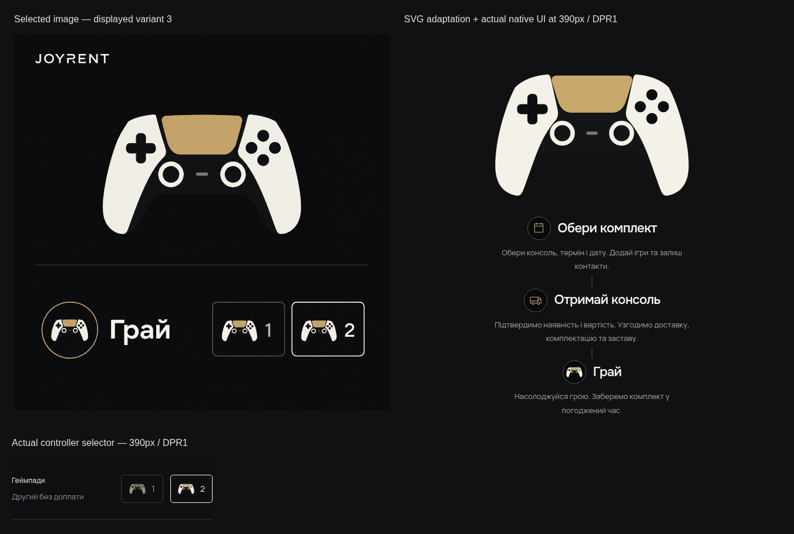

# JOYRENT 1.8.1 — выбранная иконка DualSense

[Тема](../../releases/joyrent-1.8.1.zip) · [Визуальный preview](../../releases/joyrent-preview-1.8.1.zip) · [Установка](../INSTALL.md)

Пользователь выбрал третье отображённое изображение и приложил его повторно. [Исходный вариант](icons/selected-source.png) перенесён в прозрачный SVG: белые рукоятки, золотая панель, чёрные кнопки и два кольца стиков. Пользователь ранее разрешил SVG-адаптацию выбранного изображения. Изображение использовано для формы и цветовой схемы иконки; вся композиция генерации не является новым макетом страницы.

Общий компонент используется в этапах, выборе одного/двух геймпадов и заглушке отсутствующей обложки. Размеры и расположение сохраняются. Невыбранная иконка имеет opacity 0.58, выбранная — 1; геометрия при выборе не меняется. SVG декоративный, скрыт от скринридера и не создаёт отдельной точки фокуса. Плагин, карта, фото, игры, цены и настройки не менялись.

[Этапы на телефоне UA](screens/uk-390-process.png) · [Выбор геймпадов UA](screens/uk-390-controller-options.png) · [Этапы RU](screens/ru-390-process.png) · [Этапы на ПК](screens/uk-1440-process.png) · [SVG](icons/selected-controller.svg)

TypeScript/build/package и 46 существующих тестов прошли. Финальный браузерный запуск: **6 PASS / 0 FAIL**, UA/RU320/390/1440 на `main-DM1WMT1u.js` / `main-JIqLnITd.css`. Реальные клики, Enter/Space, выбранное состояние, бесплатный второй геймпад, область нажатия, переполнение и исключения проверены. Заявки и email не отправлялись. [Browser receipt](browser-check.json) · [Package receipt](package-check.json).

История: [начальный harness](initial-harness-check.json) дал 4 PASS/2 FAIL по opacity. [Диагностика](opacity-diagnostic.json) показала новую DOM-классификацию и старый computed style до следующего кадра; проверка синхронизирована двумя RAF без изменения поведения сайта. [Полный повтор до визуальной правки](before-curve-check.json) — 6 PASS. После сравнения исправлен реальный P2: кольца почти касались рукояток, а нижняя перемычка была угловатой. [Первое сравнение](icons/first-comparison.png); затем форма исправлена, сборка обновлена и все 6 случаев сняты заново. Старые результаты не входят в финальный счёт.

При установленном плагине 1.7 замените только тему и очистите кэш. На хостинг эта работа изменения не загружает. Физический iOS/Safari и SMTP не проверялись.
