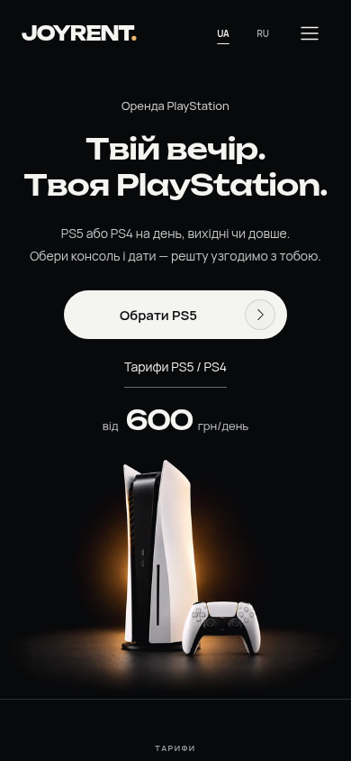

# JOYRENT 1.9.1 — аудит и исправления

Проверены живой `flowers-luxury.shop` с темой 1.9.0 и плагином 1.8.0, затем готовая локальная сборка темы 1.9.1. Украинская и русская версии проверены на 320, 390 и 1440px; для первого экрана дополнительно проверены границы 700/701px. Основной порядок разделов и гарнитуры сохранены. Новые изменения применяются **только обновлением темы**.

[Тема 1.9.1](../../releases/joyrent-1.9.1.zip) · [Preview 1.9.1](../../releases/joyrent-preview-1.9.1.zip) · [Установка](../INSTALL.md#обновление-до-191).

[Первый экран до и после, 390×844](hero-before-after.png).

## Логика и структура

1. **Первый экран → тарифы: понятно.** На телефоне композиция следует присланному макету: подпись, две строки заголовка, описание, основная кнопка, ссылка на тарифы, цена. Заголовок и описание центрированы. Кнопка 248×54px со шевроном имеет спокойную реакцию на нажатие; фото продолжается ниже. [Готовая сборка](screens/uk-390-hero.png) · [RU320](screens/ru-320-hero.png).
2. **Игры → комплект: порядок подходит.** Каталог помогает выбрать сценарий игры перед оформлением. Основная фотография, комплект, текущие цены и бесплатный второй геймпад сохраняются. Подпись о подтверждении наличия остаётся читаемой. [Каталог до изменений](typography/03-uk-390-games.png) · [комплект](typography/04-uk-390-kit.png).
3. **Этапы → доставка: понятно.** Ссылка «Як отримати консоль / Как получить консоль» ведёт к этапам аренды. В тарифах уточнено, что включённая доставка действует в зелёной и жёлтой зонах; повторная сноска не возвращалась. [Свежий снимок доставки на хостинге](live/uk-1440-delivery.png) · [тарифы готовой сборки](screens/ru-320-tariffs.png).
4. **Калькулятор → комплектация: улучшено.** Игры расположены после геймпадов, перед выбором залога или договора. Заголовок, пояснение и кнопка объединены в карточку. Выбранные игры и отдельное пожелание видны сразу; их можно удалить. На телефоне кнопка занимает ширину карточки. [До](typography/38-uk-390-booking-games.png) · [после на телефоне](screens/uk-390-booking-games-selected.png) · [на ПК](screens/uk-1440-booking-games-selected.png).
5. **Подборка → отсутствующая игра: исправлено.** Сначала каталог, затем панель «Не знайшли гру? / Не нашли игру?». В пустом поиске кнопка «Запросити гру / Запросить игру» открывает поле, подставляет название и переводит туда фокус. Сворачивание сохраняет пожелание. Наличие подтверждается после заявки. [До — указание на скрытое поле](typography/10-uk-390-picker-no-results.png) · [после](screens/uk-390-game-picker-request.png).
6. **Контакты → заявка: проверено с ограничением Safari.** Enter переводит между полями; адрес можно выбрать или ввести вручную. Исправлены положение подсказок и потеря выбора при blur во время касания. Имя, телефон, адрес и пожелание не попадают в browser storage. Краткая конфиденциальность теперь описывает реальные поля, без удалённого города и Telegram. [Адрес RU320](screens/ru-320-contact-address-selected.png).

## Найденные дефекты и исправления

| Приоритет | Дефект | Исправление и доказательство |
|---|---|---|
| P2 | Пустой поиск предлагал написать название «выше», хотя поле было закрыто. | Явная кнопка запроса открывает и фокусирует поле. [До](typography/10-uk-390-picker-no-results.png), [после](screens/uk-390-game-picker-request.png). |
| P2 | Подсказки полей имели контраст 3,87:1. | Цвет стал светлее, сохранены размеры 16px для текстовых полей. Контраст подсказок контактов стал 6,68:1; поиска — 9,28:1, названия игры — 8,92:1. [Аудит текста](typography/findings.json). |
| P2 | Список улиц выходил ниже короткой видимой области экрана. | Список выбирает верх или низ по visualViewport, ограничивает высоту и прокручивается внутри. [Исходный FAIL](address-short-viewport-regression.before.json), [после](address-short-viewport-regression.json), [снимок](address-option-below-short-viewport.png). |
| P2 | Pointer-нажатие с последующим blur удаляло подсказку до завершения выбора. | DOM сохраняется до pointerup; выбор не зависит от синтезированного click. Движение пальца, прокрутка и отмена касания отменяют выбор. [Исходная модель 0/2](address-pointer-transaction-check.before.json), [готовая сборка 2/2 и защитные проверки](address-packaged-pointer-check.json). |
| P2 | В первой итерации нового окна игр фиксированные toolbar/footer перекрывали содержимое при высоте 220px. | На высоте до 360px поиск и каталог прокручиваются вместе, «Готово» остаётся отдельным рядом. Независимая перепроверка 6/6; исходная геометрия и ошибка клика сохранены, исходный снимок отсутствует. [Review](review/review.json), [готовая сборка 844×220](screens/uk-844x220-request.png). |
| P3 | Выбор игр выглядел оторванным от формы. | Компактная карточка рядом с комплектацией, выбранные названия и пожелание видны после закрытия подборки. |
| P3 | Краткая конфиденциальность описывала старые поля, а тарифная подпись не уточняла зоны доставки. | Согласованы актуальные тексты UA/RU без новых рекламных фраз или секций. |

В мобильной итерации заголовок немного выходил за внутреннюю колонку. Формула размера уменьшена с 8,55vw до 8,3vw; повторные измерения подтвердили две строки внутри колонки. [Проверка первого экрана](hero-mobile/browser-check.json).

## Читаемость и оформление

Manrope, Unbounded и Onest корректно загружаются с кириллицей. Ошибок символов или замены шрифтов в проверенных состояниях нет; полной смены гарнитур не требуется. Основной текст остаётся 13–16px, поля контактов, поиска и названия игры — 16px. Новый блок игр получил заголовок 17/18px и кнопки не ниже 44px; основная кнопка — 48px. Пояснения поля названия и доступности отделены от действия.

На [21st.dev](https://21st.dev/) просмотрены три конкретных варианта кнопок: [Interactive Hover Button](https://21st.dev/@dillionverma/components/interactive-hover-button), [Shiny Button](https://21st.dev/@dillionverma/components/shiny-button) и [Shimmer Button](https://21st.dev/@dillionverma/components/shimmer-button), Dillion Verma / Magic UI, MIT. Для мобильного CTA взят принцип компактной кнопки с отдельным значком; реализация самостоятельная, исходный TSX и новые зависимости не добавлены. Текст неподвижен; reduced motion отключает движение. [Источники и наблюдения](references/21st-buttons.json).

## Проверка выпуска

- **55/55** unit-тестов; TypeScript/Vite/package завершены успешно. [Тесты](test.log) · [сборка](build.log).
- **6/6** свежих сценариев готовой WordPress-сборки: UA/RU320/390/1440. Дополнительно 844×220 и 320×280. Проверены порядок, шрифты, контраст, выбранные игры, поиск, пожелание, поля, возврат фокуса, вложенные диалоги и payload. [Отчёт](browser-check.json).
- **6/6** свежих сценариев живого сайта в анонимных контекстах Chromium153: установленная версия подтверждена по JS/CSS. На хостинге выбор улицы мышью и эмуляцией касания работал во всех шести случаях; жалоба физического Safari этим не воспроизведена. [Live-отчёт](live/browser-check.json).
- Отдельная проверка готовой сборки воспроизводит blur между pointerdown и pointerup без дополнительного click; номер дома и квартиры сохраняется. [Адресные проверки](address-packaged-pointer-check.json).
- Новый интерфейс подборки проверен отдельно на пяти коротких областях, включая visualViewport220 при layout390×844. [Отчёт](game-picker-short-check.json). Независимый review не оставил подтверждённых P1/P2.
- ZIP прошли CRC, проверку прав и побайтовое сравнение с исходниками. Все 38 исторических файлов выпуска и архив плагина 1.8.0 сохранены точно. Приватного получателя нет в архивах. [Проверка пакетов](package-check.json).

Финальная сборка: `main-RbwlY1GP.js` / `main-CHr9P0rc.css`. Vite сохраняет предупреждение о размере основного JS: 513,13kB / 159,05kB gzip. Карта и Leaflet загружаются отдельно.

На живом сайте запросы записи блокировались до передачи, финальная отправка не выполнялась. В локальных шести сценариях использован только перехваченный подставной ответ 200; реальные заказы и письма — **0**. Хостинг этим выпуском не изменён.

Физические iPhone Safari, экранная клавиатура iOS и VoiceOver недоступны в среде проверки. Подготовленное исправление устраняет подтверждённую модель потери выбора, но окончательная проверка жалобы на устройстве остаётся после установки темы и очистки кэша. Доставка почты хостинга также не проверялась.
