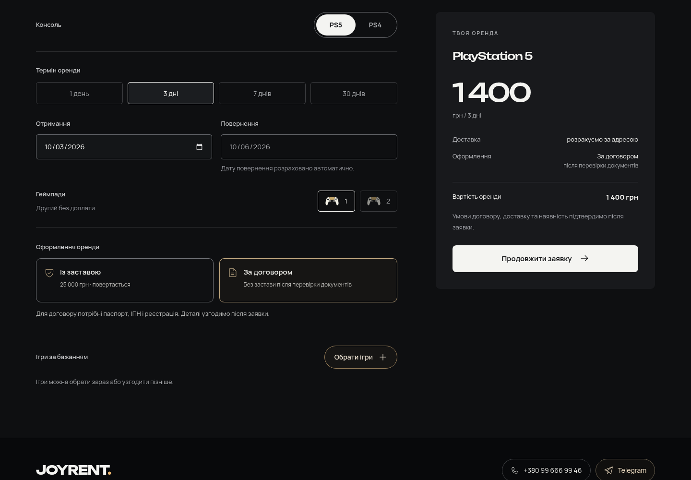

# JOYRENT 1.9.0

Тема 1.9.0 и плагин 1.8.0 обновляют главную и оформление заявки в украинской и русской версиях. Сохраняются стиль сайта, цены аренды, залоги PS4/PS5 и бесплатный второй геймпад.

1. В footer вместо строки о торговой марке — «З турботою про твій вечір.» / «С заботой о твоём вечере.».
2. Важное пояснение под играми отцентрировано, увеличено до 16 px на ПК и 15 px на телефоне, повышен контраст.
3. Повтор условий доставки под тарифами удалён. Кнопка «Як отримати консоль / Как получить консоль» по центру и ведёт к этапам аренды.
4. В форме можно выбрать залог или договор. Условия договора основаны на [Funbox](https://funbox.com.ua/#rec524506397): паспорт, ИНН и регистрация; возможность аренды без денежного залога подтверждается после личной проверки документов. Загрузки документов на сайте нет. Выбор передаётся в заявку, итог аренды не меняется.
5. Кнопка зон доставки получила мягкий золотистый блик каждые 6,4 секунды. Идея — [Shiny Button на 21st.dev](https://21st.dev/@dillionverma/components/shiny-button), Magic UI, MIT; адаптация выполнена на CSS без новой зависимости. Текст неподвижен; анимация отключается при reduced motion и приостанавливается вне экрана, в скрытой вкладке и при открытой карте.
6. В контактах оставлен только адрес доставки, без отдельного поля города. Подсказки улиц Одессы работают из локального списка OpenStreetMap: например, «Фонтанская» предлагает «Фонтанская дорога». Можно ввести любой адрес вручную. Внешние адресные API не вызываются; подсказка улицы не определяет зону доставки.
7. Поля контактов и поиска используют шрифт 16 px, подходящие подсказки автозаполнения и управление клавиатурой. Enter в полях не отправляет заявку случайно; в адресе выбирает подсказку. Проверены фокус диалогов, Tab/Shift+Tab, Escape и возврат на кнопку открытия.
8. Кнопка выбора игр стала заметнее, на телефоне занимает ширину блока. В подборке добавлены поиск и «Не нашли игру в списке?» с полем названия. Пожелание передаётся владельцу для проверки наличия, без обещания доступности. Оно не записывается в sessionStorage/localStorage; как и контакты, хранится только в состоянии открытой формы до отправки.

Проверки завершены: **55/55** unit-тестов, **214/214** серверных проверок и **6/6** сценариев готовой сборки в Chromium: UA/RU на 320, 390 и 1440 px. Проверены суммы, выбранное оформление, поиск игр, пожелание вне списка, вложенные диалоги, фокус, клавиатура, ввод адреса на обоих языках и сохранение номера дома. Исправлены две найденные ошибки: полное русское название улицы оставляло подсказки открытыми на UA; Enter на checkbox согласия мог случайно отправить заявку.

Браузерные отправки получили только подставной ответ Playwright: реальные запросы записи, заказы и письма — 0. PHP-сценарии создавали локальные fixtures и перехватывали уведомления; после проверки заказы и настройки восстановлены. Ошибок JavaScript/HTTP в шести сценариях нет. Физический iPhone и настоящая доставка почты на хостинге не проверялись.

[Браузерный отчёт](browser-check.json) · [Оформление и анимация](polish-sections-check.json) · [Серверный отчёт](backend-check.json) · [Проверка адреса](address-complete-check.json) · [Проверка архивов](package-check.json) · [Сборка](build.log) · [Unit-тесты](test.log).

Снимки: [контакты на телефоне](screens/uk-390-contact.png) · [игры на телефоне](screens/uk-390-game-picker.png) · [оформление на телефоне](screens/uk-390-booking.png) · [RU контакты](screens/ru-390-contact.png).

Сборка TypeScript/Vite и все три ZIP готовы. Vite выдаёт предупреждение о размере основного JS: 506,74 kB / 157,06 kB gzip. Карта и Leaflet загружаются отдельно при открытии.

Для применения всех изменений нужны [тема 1.9.0](../../releases/joyrent-1.9.0.zip) и [плагин 1.8.0](../../releases/joyrent-rentals-1.8.0.zip). [Локальное превью](../../releases/joyrent-preview-1.9.0.zip). Обновление страниц плагина заменяет только точные прежние стандартные тексты; авторские страницы, заказы и закрытый получатель уведомлений сохраняются. На хостинг эта сборка не публиковалась.
